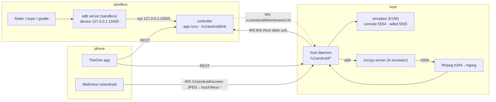

# App runs and the Android emulator

Run, view, drive and test the apps of a project from the phone: web apps, Expo /
React Native, Flutter and Electron. Everything that renders in a browser is opened
by URL, Expo apps open natively on the phone, desktop builds (Flutter Linux,
Electron) draw on the sandbox display (VNC), and Android builds run on an
emulator **on the host** (KVM) whose screen is streamed to the phone with touch
and keys passed back.



## 1. Run targets (sandbox controller)

### 1.1 Detection

`FRAMEWORKS` gains `flutter`: a project with `pubspec.yaml` whose content contains a
`flutter:` SDK dependency (`sdk: flutter`) and no `package.json` is `flutter`.

`RUN_TARGETS` (new constant, in this order):

| Target | Offered when | Command (cwd = project) | Viewer |
|---|---|---|---|
| `web-dev` | framework `vite`, `next` or `node` with a `dev` (preferred) or `start` script | `<pm> run dev\|start` + vite: `-- --host 0.0.0.0 --port $P --strictPort`, next: `-- -H 0.0.0.0 -p $P`, else env `PORT=$P HOST=0.0.0.0` | `url` |
| `expo-device` | framework `expo` | `npx expo start --port $P` (`--dev-client` when `expo-dev-client` is a dependency, else `--go`) with `CI=1`, `EXPO_NO_TELEMETRY=1`, `REACT_NATIVE_PACKAGER_HOSTNAME=<phone host>` | `deeplink` |
| `expo-web` | framework `expo` and `react-native-web` is a dependency | `npx expo start --web --port $P`, `CI=1` | `url` |
| `expo-android` | framework `expo` | `npx expo run:android --port $P --device $ANDROID_SERIAL` | `android` |
| `rn-android` | framework `react-native` with `android/gradlew` | `npx react-native start --port $P` + `npx react-native run-android --port $P --deviceId $ANDROID_SERIAL` (two processes; the run ends with Metro) | `android` |
| `flutter-web` | framework `flutter` | `flutter run --machine -d web-server --web-hostname 0.0.0.0 --web-port $P` | `url` |
| `flutter-linux` | framework `flutter` and `linux/` exists | `flutter run --machine -d linux` with `DISPLAY` | `display` |
| `flutter-android` | framework `flutter` and `android/` exists | `flutter run --machine -d $ANDROID_SERIAL` | `android` |
| `electron-dev` | framework `electron` with a `dev` (preferred) or `start` script | `<pm> run dev\|start` with `DISPLAY` | `display` |
| `test` | `flutter` → `flutter test`; package.json with a `test` script → `<pm> run test` (`CI=1`) | — | `none` |

`<phone host>` is the sandbox Tailscale IPv4 (same source as `GET /v1/ports`), else the
host part of `THEONE_PUBLIC_URL`. `$P` is `StartAppRun.port` or, when omitted, the first
free port from the target's default (`web-dev` 5173, `expo-*`/`rn-android` 8081,
`flutter-web` 8090), checked like `StartProcess.port`.

**Availability** (`RunTargetInfo.available`/`reason`): `flutter-*` and `test` on a Flutter
project need `flutter` on `PATH` (`Flutter SDK is not installed`); `*-android` need
`adb` and a linked host emulator in state `running`
(`Link the host Android emulator first` / `Start the emulator on the host`);
`flutter-linux`/`electron-dev` need the display (`DisplayStatus.available`).
Unavailable targets are still listed.

### 1.2 App runs

An **app run** wraps one or two tracked processes (`ProcessService.spawn`), so logs,
stop and the process list work unchanged. App runs live in memory for the controller
lifetime (like terminals); their processes are persisted as today.

```ts
RUN_TARGETS = ["web-dev","expo-device","expo-web","expo-android","rn-android",
               "flutter-web","flutter-linux","flutter-android","electron-dev","test"]
APP_RUN_STATES = ["starting","ready","failed","stopped","exited"]
APP_RUN_ACTIONS = ["reload","restart","focus"]
ID_PREFIXES.appRun = "app_"

AppViewer =
  | { kind: "url", url: string | null, localUrl: string }          // url null without a phone host
  | { kind: "deeplink", devClientUrl: string | null, expoGoUrl: string, manifestUrl: string }
  | { kind: "display" }
  | { kind: "android", serial: string }                             // the sandbox adb serial
  | { kind: "none" }

RunTargetInfo { target, label, available, reason: string | null, viewer: AppViewer["kind"], actions: AppRunAction[] }
AppRun {
  id, projectId, target, state, port: number | null,
  processIds: ProcessId[],          // [main] or [metro, gradle] for rn-android
  viewer: AppViewer | null,         // set once ready
  actions: AppRunAction[],          // supported by this target
  error: string | null,
  startedAt, readyAt: string | null, endedAt: string | null,
}
StartAppRun { target, port? }
AppRunActionRequest { action }
```

- `deeplink`: `expoGoUrl = exp://<phone host>:$P`, `manifestUrl = http://<phone host>:$P`,
  `devClientUrl = exp+<slug>://expo-development-client/?url=<encodeURIComponent(manifestUrl)>`
  when `expo-dev-client` is a dependency (slug from `app.json` `expo.slug`, else
  `npx expo config --json --type public`), else null.
- **Ready**: flutter targets on the machine-protocol event `app.started`; port targets
  (`web-dev`, `expo-device`, `expo-web`) when the port accepts TCP; `electron-dev` when a
  window of the process tree exists (`xdotool search --pid`), polled every 500 ms;
  `expo-android`/`rn-android` when the log shows `BUILD SUCCESSFUL` and Metro's port
  accepts TCP; `test` never becomes `ready` (it ends `exited` on code 0, else `failed`).
  A run that is not ready after 15 min is stopped and `failed` with
  `Did not become ready within 15 minutes`.
- Ending: when the main process ends the run ends (`stopped` if requested, `exited` on
  code 0, else `failed` with the last error line). Stopping a run stops all its processes.
- **Flutter machine mode**: stdout lines that are `[{...}]` JSON are daemon events. They
  are written to the process log as readable text (`app.log` → its `log`, `daemon.logMessage`
  → `message`, `app.progress` → `message` when present, `app.started` → `App started`,
  other events dropped). stdin is a pipe kept open for flutter targets only.
- **Actions**: `reload` (flutter: `app.restart` `fullRestart:false`; expo/rn: Metro
  reload broadcast, §1.4), `restart` (flutter: `fullRestart:true`; expo/rn: same as
  reload), `focus` (display targets: `xdotool search --pid <pid tree>` → `windowactivate`
  and maximize via `wmctrl -r :ACTIVE: -b add,maximized_vert,maximized_horz` when present).
  An unsupported action or a run that is not `ready` → 409.
- Supported actions: flutter-web/flutter-android `reload,restart`; flutter-linux
  `reload,restart,focus`; expo-device/expo-android/rn-android `reload,restart`;
  electron-dev `focus`; others none.

### 1.3 REST

| Method | Path | Body | Response |
|---|---|---|---|
| GET | `/v1/projects/:id/run-targets` | — | `RunTargetInfo[]` (only targets offered for the project); 404 unknown project |
| GET | `/v1/app-runs` | `?projectId=` | `AppRun[]` newest first |
| POST | `/v1/projects/:id/app-runs` | `StartAppRun` | `201 AppRun`; 400 target not offered; 503 target unavailable (message = `reason`); 409 port taken or a run of the same target for that project is `starting`/`ready` |
| GET | `/v1/app-runs/:id` | — | `AppRun` |
| DELETE | `/v1/app-runs/:id` | — | `AppRun` after its processes stopped |
| POST | `/v1/app-runs/:id/actions` | `AppRunActionRequest` | `200 AppRun`; 409 as above; 502 when the action failed (message) |
| GET | `/v1/android` | — | `SandboxAndroidStatus` (§2.3) |

Events: `{ type: "app.updated", run: AppRun }` on every state change.

### 1.4 Metro reload

`reload` connects to `ws://127.0.0.1:$P/message` and sends
`{"version":2,"method":"reload"}` (the dev menu's broadcast), closing after send. 502
when the socket cannot be opened within 3 s.

## 2. Android emulator on the host

### 2.1 Host daemon config (`theone-controller host serve`)

| Variable | Default | Meaning |
|---|---|---|
| `THEONE_ANDROID_SDK_ROOT` | `$HOME/.local/share/theone/android-sdk` if it has `emulator/emulator`, else `$ANDROID_SDK_ROOT`, else `$ANDROID_HOME` | SDK with `emulator/` and `system-images/` |
| `THEONE_ADB` | `adb` on `PATH` | host adb client (talks to the user's normal adb server on 5037) |
| `THEONE_SCRCPY_SERVER` | first of `/usr/share/scrcpy/scrcpy-server`, `/usr/local/share/scrcpy/scrcpy-server` | scrcpy server jar |
| `THEONE_SCRCPY_VERSION` | parsed from `scrcpy --version` | must equal the jar's version |
| `THEONE_FFMPEG` | `ffmpeg` on `PATH` | H.264 → MJPEG |
| `THEONE_EMULATOR_PORT` | `5554` | console port; adbd = +1; serial `emulator-<port>` |
| `THEONE_EMULATOR_GPU` | `swiftshader_indirect` | `-gpu` |

AVDs come from `emulator -list-avds` (with `ANDROID_SDK_ROOT`/`ANDROID_HOME` set to the
SDK root). The emulator runs as
`emulator -avd <avd> -port <port> -no-window -no-audio -no-boot-anim -skip-adb-auth -gpu <gpu>`
(+ `-no-snapshot-load` for `coldBoot`, `-wipe-data` for `wipeData`), detached in its own
process group, logs kept in a ring buffer. Booted = `adb -s <serial> shell getprop
sys.boot_completed` prints `1` (polled every 2 s, 5 min timeout → `failed`). An emulator
already on `<serial>` when the daemon starts is adopted (`managed: false`; stop sends
`adb -s <serial> emu kill`).

### 2.2 Host API (added to §5.7; auth = session unless noted)

```ts
EMULATOR_STATES = ["unavailable","stopped","starting","running","stopping","failed"]
EmulatorInfo { state, avd: string | null, serial: string | null, managed: boolean,
               width: number | null, height: number | null, startedAt: string | null, error: string | null }
AndroidLinkInfo { configured: boolean, sandboxUrl: string | null, connected: boolean, lastError: string | null }
HostAndroidStatus { available: boolean, reason: string | null, sdkRoot: string | null,
                    avds: string[], scrcpy: boolean, ffmpeg: boolean, emulator: EmulatorInfo, link: AndroidLinkInfo }
StartEmulator { avd, coldBoot?: boolean, wipeData?: boolean }
LinkSandbox { sandboxUrl: string (http/https URL), token: string }
```

| Method | Path | Body | Response |
|---|---|---|---|
| GET | `/v1/android` | — | `HostAndroidStatus` (never fails because a tool is missing: `available:false` + `reason`) |
| POST | `/v1/android/emulator` | `StartEmulator` | `202 EmulatorInfo` (`starting`); 409 when not `stopped`/`failed`; 404 unknown AVD; 503 when not `available` |
| DELETE | `/v1/android/emulator` | — | `EmulatorInfo` (`stopping`, then `stopped`) |
| POST | `/v1/android/link` | `LinkSandbox` | `200 AndroidLinkInfo`; saved to `state.json` (0600) as `androidLink`, the daemon (re)connects at once |
| DELETE | `/v1/android/link` | — | `AndroidLinkInfo` (cleared, link closed) |
| WS | `/v1/android/screen?ticket=&maxSize=` | §2.4 | the emulator screen |
| GET | `/ui/android` | — | the screen page (no secrets; fragment `#ticket=…&maxSize=…`) |

### 2.3 Sandbox link (host dials the sandbox)

The host daemon, when `androidLink` is configured, keeps one WebSocket to the sandbox:
`POST <sandboxUrl>/v1/auth/ticket` (bearer `token`) then
`WS <sandboxUrl>/v1/android/link?ticket=`. Reconnect with backoff 1 s → 30 s. The sandbox
never holds a host credential: it only ever sees bytes of the emulator's adbd port.

Messages (text JSON, zod-validated, discriminated on `type`):

- host → sandbox: `{type:"hello", hostId, version}`, `{type:"emulator", emulator: EmulatorInfo}`
  (on connect and on every change), `{type:"refuse", streamId, message}`, `{type:"pong"}`.
- sandbox → host: `{type:"open", streamId}`, `{type:"ping"}` (every 20 s).

A newer link replaces an older one (old closed with 4000 `replaced`). While linked and the
emulator is `running`, the controller listens on `127.0.0.1:$THEONE_ADB_TUNNEL_PORT`
(default `15555`) and runs `adb connect 127.0.0.1:<port>` (adb serial
`127.0.0.1:15555`); when the emulator leaves `running` or the link drops it runs
`adb disconnect` and closes the listener. Each accepted TCP connection gets a new
`streamId` (`createId("adbStream")`, prefix `adb_`), the controller sends `open`, and the host opens
`WS <sandboxUrl>/v1/android/link/streams/:streamId?ticket=` (fresh ticket) and pipes it to
`127.0.0.1:<adbd port>`. Binary frames both ways carry raw TCP bytes; either side closing
closes the other. No data socket within 10 s, or `refuse` → the TCP connection is closed.

`SandboxAndroidStatus { linked: boolean, hostId: string | null, emulator: EmulatorInfo | null,
adbSerial: string | null, adbConnected: boolean }` (`GET /v1/android` on the controller).

Env on the controller: `THEONE_ADB_TUNNEL_PORT` (`15555`), `THEONE_ADB` (`adb`).
App runs of `*-android` targets get `ANDROID_SERIAL=127.0.0.1:<port>`.

### 2.4 Screen stream (`WS /v1/android/screen`)

The daemon runs one scrcpy session per emulator while at least one screen socket is open
(fan-out to all). It pushes `THEONE_SCRCPY_SERVER` to `/data/local/tmp/scrcpy-server.jar`,
`adb forward tcp:<free local port> localabstract:scrcpy_<scid>` and starts
`CLASSPATH=/data/local/tmp/scrcpy-server.jar app_process / com.genymobile.scrcpy.Server <version> scid=<scid> tunnel_forward=true audio=false control=true video_codec=h264 max_size=<maxSize> max_fps=30 send_frame_meta=true send_device_meta=true send_codec_meta=true send_dummy_byte=true cleanup=true`
(exact option names and socket order verified against the scrcpy source of that version).
The video socket's H.264 Annex-B stream goes to
`ffmpeg -fflags nobuffer -flags low_delay -f h264 -i pipe:0 -f image2pipe -c:v mjpeg -q:v 5 pipe:1`;
JPEG frames are split on SOI/EOI and sent as binary messages. A socket whose
`bufferedAmount` exceeds 512 KiB skips frames until it drains.

Server → client text: `{type:"meta", deviceName, width, height}` (first, and again as
`{type:"size", width, height}` when the video size changes), `{type:"error", message}`.

Client → server text (zod):

```ts
{ type: "touch", action: "down"|"move"|"up"|"cancel", pointerId: int 0..9, x, y, width, height, pressure: 0..1 }
{ type: "scroll", x, y, width, height, hscroll: -16..16, vscroll: -16..16 }
{ type: "key", key: "back"|"home"|"app_switch"|"power"|"volume_up"|"volume_down"|"enter"|"del"|"tab"|"escape"|"up"|"down"|"left"|"right" }
{ type: "text", text: string (≤ 300) }
{ type: "rotate" }
```

`x,y` are in the `width × height` space the client used (the last `meta`/`size`); the
daemon writes scrcpy control messages (inject touch with the screen size it last
announced, keycode down+up, inject text, inject scroll, rotate device). Touch in the
page: pointer events (multi-touch, `pointerId` mapped to 0..9), finger pressure 1.

The page `/ui/android` (built like `/ui/vnc`, same `window.theone` bridge and
`theone-insets`) draws frames on a canvas letterboxed to the viewport, has a bottom bar
(◁ back, ○ home, ▢ recents, ⌨ keyboard, ⟳ rotate) and a hidden input whose text goes as
`text` and Backspace/Enter as `key`.

## 3. Mobile

- **Project screen → Run**: `RunTargetInfo` list (start; unavailable ones show `reason`),
  active `AppRun`s with state, actions, **Logs** (existing process log view of
  `processIds[0]`), **Stop**, and **Open** per viewer: `url` → in-app WebView screen;
  `deeplink` → `Linking.openURL(devClientUrl ?? expoGoUrl)`; `display` → the display
  screen; `android` → the host emulator screen (pair/unlock the host first if needed).
  Live updates from `app.updated`.
- **Host → Android emulator**: `HostAndroidStatus`, AVD picker, Start/Stop, **Open screen**
  (WebView of `/ui/android` with a ticket), **Link sandbox** (posts the active sandbox's
  base URL and token to `POST /v1/android/link`), link state.

## 4. Sandbox image

`WITH_FLUTTER` (default `true`), `FLUTTER_VERSION` (default `3.47.5`): Flutter SDK cloned
at that tag into `/opt/flutter` (owned by `dev`), on `PATH`, `flutter config
--no-analytics --android-sdk /opt/android-sdk`, `flutter precache --web --linux`. Linux
desktop deps in `desktop`: `clang cmake ninja-build pkg-config libgtk-3-dev liblzma-dev
libstdc++-14-dev wmctrl`. `adb` comes from the Android platform-tools (`WITH_ANDROID`).
