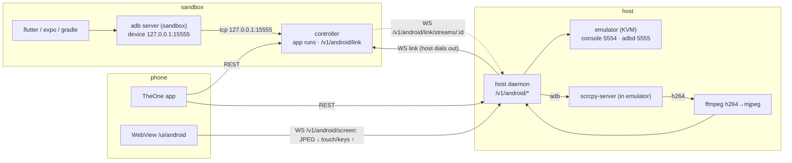

# App runs and the Android emulator

Run, view, drive and test the apps of a project from the phone: web apps, Expo /
React Native, Flutter and Electron. Everything that renders in a browser is opened
by URL, Expo apps open natively on the phone, desktop builds (Flutter Linux,
Electron) draw on the sandbox display (VNC), and Android builds run on an
emulator **on the host** (KVM) whose screen is streamed to the phone with touch
and keys passed back.



## 1. Run targets (sandbox controller)

### 1.1 Detection

`FRAMEWORKS` gains `flutter`: a project with `pubspec.yaml` whose content contains a
`flutter:` SDK dependency (`sdk: flutter`) and no `package.json` is `flutter`.

`RUN_TARGETS` (new constant, in this order):

| Target | Offered when | Command (cwd = project) | Viewer |
|---|---|---|---|
| `web-dev` | framework `vite`, `next` or `node` with a `dev` (preferred) or `start` script | `<pm> run dev\|start` + vite: `-- --host 0.0.0.0 --port $P --strictPort`, next: `-- -H 0.0.0.0 -p $P`, else env `PORT=$P HOST=0.0.0.0` | `url` |
| `expo-device` | framework `expo` | `npx expo start --port $P` (`--dev-client` when `expo-dev-client` is a dependency, else `--go`) with `CI=1`, `EXPO_NO_TELEMETRY=1`, `REACT_NATIVE_PACKAGER_HOSTNAME=<phone host>` | `deeplink` |
| `expo-web` | framework `expo` and `react-native-web` is a dependency | `npx expo start --web --port $P`, `CI=1` | `url` |
| `expo-android` | framework `expo` | `npx expo run:android --port $P --device $ANDROID_SERIAL` | `android` |
| `rn-android` | framework `react-native` with `android/gradlew` | `npx react-native start --port $P` + `npx react-native run-android --port $P --deviceId $ANDROID_SERIAL` (two processes; the run ends with Metro) | `android` |
| `flutter-web` | framework `flutter` | `flutter run --machine -d web-server --web-hostname 0.0.0.0 --web-port $P` | `url` |
| `flutter-linux` | framework `flutter` and `linux/` exists | `flutter run --machine -d linux` with `DISPLAY` | `display` |
| `flutter-android` | framework `flutter` and `android/` exists | `flutter run --machine -d $ANDROID_SERIAL` | `android` |
| `electron-dev` | framework `electron` with a `dev` (preferred) or `start` script | `<pm> run dev\|start` with `DISPLAY` | `display` |
| `test` | `flutter` → `flutter test`; package.json with a `test` script → `<pm> run test` (`CI=1`) | — | `none` |

**Monorepos.** Workspace packages (package.json `workspaces`, array or `{packages}`, and
`packages:` of `pnpm-workspace.yaml`; entries `dir` or `dir/*`, no negations or other globs,
nothing outside the project, at most 64 packages) whose framework is `expo`, `react-native`,
`flutter`, `electron`, `vite` or `next` add their targets except `test`. Each target is offered
once: the project root wins, then the first package in path order. Such a target has
`dir` = the package folder (project-relative, e.g. `apps/mobile`), runs with that folder as
cwd and the root's package manager when the package has no lockfile, and its label gets
` · <dir>` (`Android emulator · apps/mobile`). Root targets have `dir: null`.

`<phone host>` is the sandbox Tailscale IPv4 (same source as `GET /v1/ports`), else the
host part of `THEONE_PUBLIC_URL`. `$P` is `StartAppRun.port` or, when omitted, the first
free port from the target's default (`web-dev` 5173, `expo-*`/`rn-android` 8081,
`flutter-web` 8090), checked like `StartProcess.port`.

**Availability** (`RunTargetInfo.available`/`reason`): `flutter-*` and `test` on a Flutter
project need `flutter` on `PATH` (`Flutter SDK is not installed`); `*-android` need
`adb` and a linked host emulator in state `running` with `isolated: true`
(`Link the host Android emulator first` / `Start the emulator on the host` /
`The host emulator is not isolated; start it from the app`);
`flutter-linux`/`electron-dev` need the display (`DisplayStatus.available`).
Unavailable targets are still listed.

### 1.2 App runs

An **app run** wraps one or two tracked processes (`ProcessService.spawn`), so logs,
stop and the process list work unchanged. App runs live in memory for the controller
lifetime (like terminals); their processes are persisted as today.

```ts
RUN_TARGETS = ["web-dev","expo-device","expo-web","expo-android","rn-android",
               "flutter-web","flutter-linux","flutter-android","electron-dev","test"]
APP_RUN_STATES = ["starting","ready","failed","stopped","exited"]
APP_RUN_ACTIONS = ["reload","restart","focus"]
ID_PREFIXES.appRun = "app_"

AppViewer =
  | { kind: "url", url: string | null, localUrl: string }          // url null without a phone host
  | { kind: "deeplink", devClientUrl: string | null, expoGoUrl: string, manifestUrl: string }
  | { kind: "display" }
  | { kind: "android", serial: string }                             // the sandbox adb serial
  | { kind: "none" }

RunTargetInfo { target, label, dir: string | null, available, reason: string | null, viewer: AppViewer["kind"], actions: AppRunAction[] }
AppRun {
  id, projectId, target, dir: string | null, state, port: number | null,
  processIds: ProcessId[],          // [main] or [metro, gradle] for rn-android
  viewer: AppViewer | null,         // set once ready
  actions: AppRunAction[],          // supported by this target
  error: string | null,
  startedAt, readyAt: string | null, endedAt: string | null,
}
StartAppRun { target, port? }
AppRunActionRequest { action }
```

- `deeplink`: `expoGoUrl = exp://<phone host>:$P`, `manifestUrl = http://<phone host>:$P`,
  `devClientUrl = exp+<slug>://expo-development-client/?url=<encodeURIComponent(manifestUrl)>`
  when `expo-dev-client` is a dependency (slug from `app.json` `expo.slug`, else
  `npx expo config --json --type public`; a slug not matching `^[a-z0-9][a-z0-9-]*$` (case-insensitive)
  is ignored), else null.
- **Ready**: flutter targets on the machine-protocol event `app.started`; port targets
  (`web-dev`, `expo-device`, `expo-web`) when the port accepts TCP; `electron-dev` when a
  visible window of the process tree exists (one `xdotool search --onlyvisible --name .*` per
  poll, `xdotool getwindowpid` only for windows not seen before), polled every 500 ms;
  `expo-android`/`rn-android` when the log shows `BUILD SUCCESSFUL` and Metro's port
  accepts TCP; `test` never becomes `ready` (it ends `exited` on code 0, else `failed`).
  A run that is not ready after 15 min is stopped and `failed` with
  `Did not become ready within 15 minutes`.
- Ending: when the main process ends the run ends (`stopped` if requested, `exited` on
  code 0, else `failed` with the last error line, or flutter's `app.stop` `error`). Stopping a
  run stops all its processes; a run stopped before any process was spawned (still choosing its
  port) ends `stopped` at once and spawns nothing.
- **Flutter machine mode**: stdout lines that are `[{...}]` JSON are daemon events. They
  are written to the process log as readable text (`app.log` → its `log`, `daemon.logMessage`
  → `message`, `app.progress` → `message` when present, `app.started` → `App started`,
  `app.stop` → `App stopped[: <error>]`, `daemon.showMessage` → `[Error: ]<title>: <message>`,
  other events dropped). stdin is a pipe kept open for flutter targets only.
- **Actions**: `reload` (flutter: `app.restart` `fullRestart:false`; expo/rn: Metro
  reload broadcast, §1.4), `restart` (flutter: `fullRestart:true`; expo/rn: same as
  reload), `focus` (display targets: the newest window of the pid tree as for readiness → `windowactivate`
  and maximize via `wmctrl -r :ACTIVE: -b add,maximized_vert,maximized_horz` when present).
  An unsupported action or a run that is not `ready` → 409.
- Supported actions: flutter-web/flutter-android `reload,restart`; flutter-linux
  `reload,restart,focus`; expo-device/expo-android/rn-android `reload,restart`;
  electron-dev `focus`; others none.

### 1.3 REST

| Method | Path | Body | Response |
|---|---|---|---|
| GET | `/v1/projects/:id/run-targets` | — | `RunTargetInfo[]` (only targets offered for the project); 404 unknown project |
| GET | `/v1/app-runs` | `?projectId=` | `AppRun[]` newest first |
| POST | `/v1/projects/:id/app-runs` | `StartAppRun` | `201 AppRun`; 400 target not offered; 503 target unavailable (message = `reason`); 409 port taken or a run of the same target for that project is `starting`/`ready` |
| GET | `/v1/app-runs/:id` | — | `AppRun` |
| DELETE | `/v1/app-runs/:id` | — | `AppRun` after its processes stopped |
| POST | `/v1/app-runs/:id/actions` | `AppRunActionRequest` | `200 AppRun`; 409 as above; 502 when the action failed (message) |
| GET | `/v1/android` | — | `SandboxAndroidStatus` (§2.3) |

Events: `{ type: "app.updated", run: AppRun }` on every state change.

### 1.4 Metro reload

`reload` connects to `ws://127.0.0.1:$P/message` and sends
`{"version":2,"method":"reload"}` (the dev menu's broadcast), closing after send. 502
when the socket cannot be opened within 3 s.

## 2. Android emulator on the host

### 2.1 Host daemon config (`theone-controller host serve`)

| Variable | Default | Meaning |
|---|---|---|
| `THEONE_ANDROID_SDK_ROOT` | `$HOME/.local/share/theone/android-sdk` if it has `emulator/emulator`, else `$ANDROID_SDK_ROOT`, else `$ANDROID_HOME` | SDK with `emulator/` and `system-images/` |
| `THEONE_ADB` | `adb` on `PATH` | host adb client (talks to the user's normal adb server on 5037) |
| `THEONE_SCRCPY_SERVER` | first of `/usr/share/scrcpy/scrcpy-server`, `/usr/local/share/scrcpy/scrcpy-server` | scrcpy server jar |
| `THEONE_SCRCPY_VERSION` | parsed from `scrcpy --version` | must equal the jar's version |
| `THEONE_FFMPEG` | `ffmpeg` on `PATH` | H.264 → MJPEG |
| `THEONE_EMULATOR_PORT` | `5554` | console port; adbd = +1 (inside the namespace when isolated); serial `emulator-<port>` when not isolated |
| `THEONE_EMULATOR_GPU` | `swiftshader_indirect` | `-gpu` |
| `THEONE_EMULATOR_ISOLATION` | `netns` | `netns`: the emulator runs in its own user + network namespace with filtered egress (below); `none`: the old behaviour, emulator on the host network (**the guest, and so the linked sandbox, can reach the host's loopback, LAN and tailnet**) |
| `THEONE_EMULATOR_ALLOW_NETS` | — | comma-separated CIDRs the isolated guest may reach although they are private (e.g. `192.168.1.0/24` for a LAN backend); invalid entries stop startup |
| `THEONE_EMULATOR_ADB_PORT` | a free port (kept in the runtime dir across daemon restarts) | host loopback port of the adb bridge; serial `127.0.0.1:<port>` |

AVDs come from `emulator -list-avds` (with `ANDROID_SDK_ROOT`/`ANDROID_HOME` set to the
SDK root). The emulator runs as
`emulator -avd <avd> -port <port> -no-window -no-audio -no-boot-anim -skip-adb-auth -gpu <gpu>`
(+ `-no-snapshot-load` for `coldBoot`, `-wipe-data` for `wipeData`), detached in its own
process group; stdout/stderr go to an append-only log file (never a pipe, so the emulator
survives the daemon), and its last line becomes `error` when it exits on its own. Booted =
`adb -s <serial> shell getprop sys.boot_completed` prints `1` (polled every 2 s, 5 min timeout
→ `failed`). Stopping the daemon leaves the emulator running; the next daemon adopts it.

**Network isolation (`netns`, default).** `-skip-adb-auth` plus a `google_apis` image means
whoever reaches adbd is root in the guest, and the emulator's user-mode network maps the
guest's `10.0.2.2` to the host's `127.0.0.1` and sends guest traffic out through the host's
network stack. Without isolation a compromised sandbox could therefore reach the user's
unauthenticated adb server on `127.0.0.1:5037` (USB phones, `host:connect`, forwards) and
every host-loopback, LAN and tailnet service. So the daemon starts the emulator as

```
unshare --user --map-root-user --net -- /bin/sh -c '<launcher>' theone-emulator \
  emulator … -http-proxy http://127.0.0.1:3128 -dns-server 127.0.0.1
```

The launcher brings up `lo` and a `dummy0` with `10.254.254.1/32` and `fd00:254::1/128`
(required: without a non-loopback IPv4 and IPv6 address getaddrinfo's `AI_ADDRCONFIG`
fails inside the namespace), writes its pid to the runtime dir, starts the helper
`theone-controller host emulator-helper --dir <dir> --console-port <port> --parent <pid>`
(hidden subcommand; the same binary, `bun <src/index.ts>` from a checkout), waits for it and
execs the emulator. The namespace has no route out, so the guest can only use what the helper offers:

| Inside the namespace (helper) | Runtime dir socket | Daemon (host side) |
|---|---|---|
| UDP `127.0.0.1:53` (guest DNS, `-dns-server`) | `dns.sock` (one connection per query, 2-byte big-endian length framing) | forwards the packet over UDP to the first `nameserver` of `/etc/resolv.conf`, 5 s timeout |
| TCP `127.0.0.1:3128` (`-http-proxy`: every guest TCP connection) | `proxy.sock` | filtering proxy (below) |
| `127.0.0.1:<port+1>` (adbd) | `adbd.sock` | adb bridge `127.0.0.1:<bridge port>` → `adbd.sock`, then `adb connect 127.0.0.1:<bridge port>` |
| `127.0.0.1:<port>` (console) | `console.sock` | not used by the daemon |

The proxy reads at most 16 KiB of request head (15 s), accepts `CONNECT host:port` (TLS,
also the guest's DNS-over-TLS attempts to `10.0.2.3:853`, which are refused) and absolute-form
`http://` requests (rewritten to origin form, `Proxy-*` headers dropped), resolves the host
name **on the host**, and answers `403` if **any** address is blocked: `0/8`, `10/8`,
`100.64/10` (tailnet), `127/8`, `169.254/16`, `172.16/12`, `192.0.0/24`, `192.168/16`,
`198.18/15`, `224/3`; `::/96` (`::`, `::1`, IPv4-compatible), `64:ff9b::/96`,
`64:ff9b:1::/48`, `100::/64`, `fc00::/7`, `fe80::/10`, `fec0::/10`, `ff00::/8`, and
IPv4-mapped `::ffff:0:0/96` by its IPv4 — unless the address is in
`THEONE_EMULATOR_ALLOW_NETS` (loopback `127/8`, `0/8` and `::/96` can never be allowed). It then dials the vetted address (no second lookup, so no DNS
rebinding) and pipes both ways (half-close passed on). At most 256 proxied connections,
10 s connect timeout, 30 min idle timeout. Denials are logged (`emulator egress denied`).

The runtime dir is `$XDG_RUNTIME_DIR/theone/emulator-<port>/` (else `<tmp>/theone-<uid>/…`;
both 0700) and holds the sockets, `emulator.pid`, `helper.pid`, `netns`
(`/proc/self/ns/net` of the helper), `adb-port`, `avd` and `emulator.log`. The serial is
`127.0.0.1:<bridge port>` (`EmulatorInfo.serial`); boot polling, `wm size`, scrcpy and the
sandbox link use it (the link dials `adbd.sock` directly). The emulator starts its own adb
server inside the namespace (it cannot see the host's); it is harmless and swept on stop.

Stop (isolated): SIGTERM to the qemu/emulator processes in the namespace (and the launcher's
process group when this daemon started it), SIGKILL after 20 s, then every process of ours
whose `/proc/<pid>/ns/net` is the emulator's namespace (helper, the in-namespace adb server,
which ignores SIGTERM, `netsimd`, crashpad) gets SIGTERM, SIGKILL after 2 s; then
`adb disconnect`, sockets and runtime dir removed. A namespace is only swept while a pid
recorded in the runtime dir is still in it (namespace inode numbers are reused).

Daemon restart: on start the daemon adopts an isolated emulator (`managed: false`, `avd`
from the runtime dir) when `helper.pid` is alive in the recorded namespace and `adbd.sock`
answers: it listens on `dns.sock`/`proxy.sock` again, re-creates the bridge on the recorded
port and runs `adb connect`. Otherwise the stale dir is removed (after sweeping its namespace
if it is verifiably ours). On daemon shutdown the bridge's connections are dropped and the
serial is `adb disconnect`ed; the emulator and helper keep running (DNS and proxy requests
fail until a daemon is back).

`netns` needs `unshare` (util-linux), `ip` (iproute2, also looked up in `/usr/sbin`, `/sbin`)
and unprivileged user namespaces; the daemon probes once with
`unshare --user --map-root-user --net -- ip link add theone0 type dummy`. If that fails,
`GET /v1/android` has `available: false` with a `reason` naming
`THEONE_EMULATOR_ISOLATION=none` and its risk. With `none` the daemon logs a warning at start.

Adoption of a plain emulator: an emulator on `emulator-<port>` started outside the daemon is
adopted (`managed: false`; stop sends `adb -s <serial> emu kill`), in both modes. With `netns`
it can be **viewed** (screen stream) but the sandbox link refuses its streams with
`Emulator is not isolated; start it from the app`. The daemon re-checks every 5 s, so an
emulator started or killed outside it is adopted or marked `stopped`
(`error: "The emulator exited"`). An adopted emulator that does not boot within the timeout
stays `failed` (not re-adopted every 5 s) until it goes away or is stopped; `POST` gives 409 meanwhile.

### 2.2 Host API (added to §5.7; auth = session unless noted)

```ts
EMULATOR_STATES = ["unavailable","stopped","starting","running","stopping","failed"]
EMULATOR_ISOLATION_MODES = ["netns","none"]
// isolated: true only for an emulator launched or adopted from the netns runtime dir
EmulatorInfo { state, avd: string | null, serial: string | null, managed: boolean, isolated: boolean,
               width: number | null, height: number | null, startedAt: string | null, error: string | null }
AndroidLinkInfo { configured: boolean, sandboxUrl: string | null, connected: boolean, lastError: string | null }
// isolation = THEONE_EMULATOR_ISOLATION of the daemon
HostAndroidStatus { available: boolean, reason: string | null, sdkRoot: string | null, isolation: "netns" | "none",
                    avds: string[], scrcpy: boolean, ffmpeg: boolean, emulator: EmulatorInfo, link: AndroidLinkInfo }
StartEmulator { avd, coldBoot?: boolean, wipeData?: boolean }
LinkSandbox { sandboxUrl: string (http/https URL, no user:password@, no #fragment), token: string }
```

| Method | Path | Body | Response |
|---|---|---|---|
| GET | `/v1/android` | — | `HostAndroidStatus` (never fails because a tool is missing: `available:false` + `reason`) |
| POST | `/v1/android/emulator` | `StartEmulator` | `202 EmulatorInfo` (`starting`); 409 when not `stopped`/`failed`; 404 unknown AVD; 503 when not `available` |
| DELETE | `/v1/android/emulator` | — | `EmulatorInfo` (`stopping`, then `stopped`); also stops an adopted emulator that is `failed` because it never booted |
| POST | `/v1/android/link` | `LinkSandbox` | `200 AndroidLinkInfo`; saved to `state.json` (0600) as `androidLink`, the daemon (re)connects at once |
| DELETE | `/v1/android/link` | — | `AndroidLinkInfo` (cleared, link closed) |
| WS | `/v1/android/screen?ticket=&maxSize=` | §2.4 | the emulator screen |
| GET | `/ui/android` | — | the screen page (no secrets; fragment `#ticket=…&maxSize=…`) |

### 2.3 Sandbox link (host dials the sandbox)

The host daemon, when `androidLink` is configured, keeps one WebSocket to the sandbox:
`POST <sandboxUrl>/v1/auth/ticket` (bearer `token`) then
`WS <sandboxUrl>/v1/android/link?ticket=`. Reconnect with backoff 1 s → 30 s. The sandbox
never holds a host credential: it only ever sees bytes of the emulator's adbd port.

Messages (text JSON, zod-validated, discriminated on `type`):

- host → sandbox: `{type:"hello", hostId, version}`, `{type:"emulator", emulator: EmulatorInfo}`
  (on connect and on every change), `{type:"refuse", streamId, message}`, `{type:"pong"}`.
- sandbox → host: `{type:"open", streamId}`, `{type:"ping"}` (every 20 s).

A newer link replaces an older one (old closed with 4000 `replaced`). While linked and the
emulator is `running`, the controller listens on `127.0.0.1:$THEONE_ADB_TUNNEL_PORT`
(default `15555`) and runs `adb connect 127.0.0.1:<port>` (adb serial
`127.0.0.1:15555`); when the emulator leaves `running` or the link drops it runs
`adb disconnect` and closes the listener. While tunnelled, `GET /v1/android` and starting a `*-android` run re-run
`adb connect` when `adb devices` no longer lists the serial (the sandbox adb server was restarted), serialized
with tunnel changes and at most once per 5 s. Each accepted TCP connection gets a new
`streamId` (`createId("adbStream")`, prefix `adb_`), the controller sends `open`, and the host opens
`WS <sandboxUrl>/v1/android/link/streams/:streamId?ticket=` (fresh ticket) and pipes it to
the emulator's adbd (`adbd.sock` in the runtime dir when isolated, else `127.0.0.1:<port+1>`).
Binary frames both ways carry raw TCP bytes; either side closing
closes the other. No data socket within 10 s, or `refuse` → the TCP connection is closed.

Host-side limits: at most 32 streams open (or opening) and 20 `open`s per second, beyond
that `refuse` (`Too many adb streams are open` / `adb streams are opened too fast`); a stream
whose adbd socket has more than 4 MiB unsent is closed; adbd → WS pauses above 1 MiB
buffered. With `THEONE_EMULATOR_ISOLATION=netns` streams to a non-isolated (adopted)
emulator are refused with `Emulator is not isolated; start it from the app`. The
`emulator` messages carry `error: "The host emulator reported an error"` instead of the host's
message (which may contain host paths); the host API keeps the detail. Logs never contain the
sandbox URL's userinfo or a ticket. A
stream buffers at most 4 MiB in each direction (TCP bytes before the data socket opens; WS
bytes the local adb client has not read yet); beyond that it is closed. A second data socket
for an attached stream is closed without touching the first.

Exposure: the tunnel listener `127.0.0.1:15555` is plain adb with no authentication. In
userspace-tailscale mode tailscaled forwards inbound tailnet TCP to loopback ports, so a
tailnet peer your ACLs allow on that port reaches the emulator's adbd (install apps, shell,
read app data) while the tunnel is up. Grant the phone only `:443` (and `:5901`); see
[security-model.md](security-model.md#exposure-a1-a2).

`SandboxAndroidStatus { linked: boolean, hostId: string | null, emulator: EmulatorInfo | null,
adbSerial: string | null, adbConnected: boolean }` (`GET /v1/android` on the controller).

Env on the controller: `THEONE_ADB_TUNNEL_PORT` (`15555`), `THEONE_ADB` (`adb`), `THEONE_FLUTTER` (`flutter`).
App runs of `*-android` targets get `ANDROID_SERIAL=127.0.0.1:<port>`.

### 2.4 Screen stream (`WS /v1/android/screen`)

The daemon runs one scrcpy session per emulator while at least one screen socket is open
(fan-out to all). It pushes `THEONE_SCRCPY_SERVER` to `/data/local/tmp/scrcpy-server.jar`,
`adb forward tcp:<free local port> localabstract:scrcpy_<scid>` and starts
`CLASSPATH=/data/local/tmp/scrcpy-server.jar app_process / com.genymobile.scrcpy.Server <version> scid=<scid> tunnel_forward=true audio=false control=true video_codec=h264 max_size=<maxSize> max_fps=30 send_frame_meta=true send_device_meta=true send_codec_meta=true send_dummy_byte=true cleanup=true`
(exact option names and socket order verified against the scrcpy source of that version).
Verified against scrcpy 4.1 on the host (spike, Android 12 emulator): connect the
video socket first, then the control socket (both to the forwarded port). The video
socket starts with 1 dummy byte, 64 bytes device name (NUL-padded), 4 bytes codec id
(`h264`); then 12-byte headers: if bit 63 of the first 8 bytes is set it is a **session**
packet (`u32 flags, u32 width, u32 height`, sent at start and on every rotation/resize —
this is the video size for touch coordinates); otherwise `u64 pts|flags (bit 62 config,
bit 61 key frame)` + `u32 size` + `size` bytes of H.264 Annex-B. Payloads go to
`ffmpeg -loglevel error -threads 1 -probesize 32 -analyzeduration 0 -flags low_delay -f h264 -i pipe:0 -fps_mode passthrough -f image2pipe -pix_fmt yuvj420p -c:v mjpeg -q:v 5 pipe:1`
(do **not** add `-fflags nobuffer`: with ffmpeg 9 it produces no output on a live pipe;
`-pix_fmt yuvj420p` is required by the mjpeg encoder). Use `node:child_process` (or
flush Bun's FileSink after every write) for ffmpeg stdin. JPEG frames are split on
SOI (`FFD8`) / EOI (`FFD9`) and sent as binary messages. Control messages (big-endian):
touch = `u8 2, u8 action(0 down,1 up,2 move,3 cancel), i64 pointerId, i32 x, i32 y, u16 w, u16 h, u16 pressure (0xffff=1.0), i32 actionButton(1), i32 buttons(1 while down, 0 on up)` (32 bytes);
key = `u8 0, u8 action(0 down,1 up), i32 keycode, i32 repeat, i32 metaState` (14 bytes);
text = `u8 1, u32 len, utf8`; scroll = `u8 3, i32 x, i32 y, u16 w, u16 h, i16 hscroll, i16 vscroll (fixed point, value/16 → i16), i32 buttons`
(21 bytes; verified live on 4.1: positive `vscroll` scrolls up); rotate = `u8 11`. The video
stream must announce codec `h264`, session sizes must be 1..4096 and a packet over 8 MiB ends
the session (`error` to every viewer). Text is cut to 300 UTF-8 bytes on a code point
boundary. A socket whose
`bufferedAmount` exceeds 512 KiB skips frames until it drains. The session is started with the
first viewer's `maxSize` (default 1280, raised to at least 160) and shared: a later viewer asking another size gets the
running session's size (its `meta`) and the last frame at once. It ends (server killed, ffmpeg
killed, forward removed) when the last viewer leaves — also when it leaves while the session
is still starting (everything acquired so far is released); when the emulator leaves `running` every
viewer gets `error` and is closed. Each viewer's pointer ids are offset (`viewer × 10 + pointerId`)
so two viewers never drive the same Android pointer, and a viewer that disconnects gets `up`
injected for the pointers it still holds down. The query is validated before the ticket is consumed.

Server → client text: `{type:"meta", deviceName, width, height}` (first, and again as
`{type:"size", width, height}` when the video size changes), `{type:"error", message}`.

Client → server text (zod):

```ts
{ type: "touch", action: "down"|"move"|"up"|"cancel", pointerId: int 0..9, x, y, width, height, pressure: 0..1 }
{ type: "scroll", x, y, width, height, hscroll: -16..16, vscroll: -16..16 }
{ type: "key", key: "back"|"home"|"app_switch"|"power"|"volume_up"|"volume_down"|"enter"|"del"|"tab"|"escape"|"up"|"down"|"left"|"right" }
{ type: "text", text: string (≤ 300 chars; the host truncates to 300 UTF-8 bytes, scrcpy's limit) }
{ type: "rotate" }
```

`x,y` are in the `width × height` space the client used (the last `meta`/`size`); the
daemon writes scrcpy control messages (inject touch with the screen size it last
announced, keycode down+up, inject text, inject scroll, rotate device). Touch in the
page: pointer events (multi-touch, `pointerId` mapped to 0..9), finger pressure 1.

The page `/ui/android` (built like `/ui/vnc`, same `window.theone` bridge and
`theone-insets`) draws frames on a canvas letterboxed to the viewport, has a bottom bar
(◁ back, ○ home, ▢ recents, ⌨ keyboard, ⟳ rotate) and a hidden input whose text goes as
`text` (chunks of ≤ 300 UTF-8 bytes, never splitting a code point) and Backspace/Enter as `key`. It posts `android-state` (`connecting|connected|disconnected|error`,
`reason` on `disconnected` and `error`; `error` when the daemon sent `{type:"error"}`, so the
app does not retry on its own) and `android-need-ticket` like the VNC page (blueprint §5.6);
frames are decoded with `createImageBitmap` (else ``), only the newest pending frame is
drawn, so it works in iOS WKWebView over plain http.

## 3. Mobile

- **Project screen → Run**: `RunTargetInfo` list (start; unavailable ones show `reason`),
  active `AppRun`s with state, actions, **Logs** (existing process log view of
  `processIds[0]`), **Stop**, and **Open** per viewer: `url` → in-app WebView screen;
  `deeplink` → `Linking.openURL(devClientUrl ?? expoGoUrl)`; `display` → the display
  screen; `android` → the host emulator screen (pair/unlock the host first if needed).
  Live updates from `app.updated`.
- **Desktop (project detail)**: when the project offers a target with viewer `android`, the
  **Display** button becomes **Run on emulator** (**Show emulator** while a run of it is
  `starting`/`ready`; an unavailable target shows its `reason`). It starts the run unless one
  is live, then opens `scrcpy --serial <GET /v1/android emulator.serial>` on the host (one
  window; the desktop runs on the host whose adb server the daemon connected the emulator to).
- **Host → Android emulator**: `HostAndroidStatus`, AVD picker, Start/Stop, **Open screen**
  (WebView of `/ui/android` with a ticket), **Link sandbox** (posts the active sandbox's
  base URL and token to `POST /v1/android/link`), link state. The emulator card shows
  `isolated` / `not isolated`; a running emulator with `isolated: false` gets a notice and
  **Link sandbox** is disabled with the reason; `isolation: "none"` gets a warning that the
  guest can reach the host network.

## 4. Sandbox image

`WITH_FLUTTER` (default `true`), `FLUTTER_VERSION` (default `3.47.5`): Flutter SDK cloned
at that tag into `/opt/flutter` (owned by `dev`), on `PATH`, `flutter config
--no-analytics --android-sdk /opt/android-sdk`, `flutter precache --web --linux`. Linux
desktop deps in `desktop`: `clang cmake ninja-build pkg-config libgtk-3-dev liblzma-dev
libstdc++-14-dev wmctrl`. `adb` comes from the Android platform-tools (`WITH_ANDROID`).
