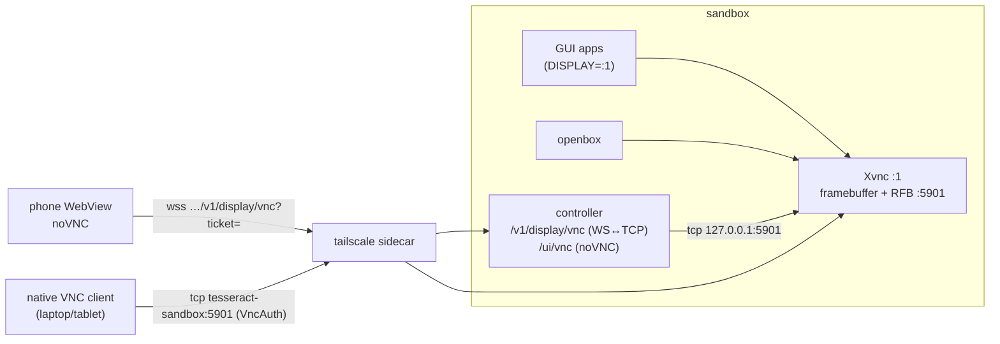

# Display and VNC

Every GUI process in the sandbox (Electron apps, wine programs, Chromium,
Android tooling UIs) draws on one virtual X display, which the user watches
and drives from the phone. Decision record:
[ADR 0004](../adr/0004-tigervnc-novnc-via-controller-bridge.md).

## Components



| Piece | Details |
|---|---|
| Xvnc (TigerVNC) | X server and VNC server in one process. Display `:1` (`TESSERACT_DISPLAY`), geometry `1600x900` (`TESSERACT_DISPLAY_GEOMETRY`), depth 24, RFB on 5901, `-SecurityTypes VncAuth -AlwaysShared -UseBlacklist=0 -nolisten tcp` (every client connects from 127.0.0.1, so the per-host blacklist would lock everyone out after a few pre-auth hang-ups). The entrypoint writes the password hash to `/home/dev/.vnc/passwd`, from `TESSERACT_VNC_PASSWORD` or else a random 8-character password generated once and kept in `/home/dev/.vnc/password` |
| openbox | a lightweight window manager, so windows get decorations, focus and move/resize. Its autostart starts the dock and opens Chromium maximized on `about:blank` so web projects can be checked on the display. Right-clicking the desktop opens a menu with Terminal (xterm) and Chromium (to reopen it after closing) |
| tint2 (dock) | a 44 px panel along the bottom (`/etc/xdg/tint2/tint2rc`, or the user's `~/.config/tint2/tint2rc` when present): **+ Terminal** and **+ Chromium** buttons, a taskbar with every window (click to focus, click the focused one to minimize, click a minimized one to restore, middle or right click to close) and a clock. It reserves its strip, so maximized windows stop above it |
| supervisord | runs `xvnc` and `openbox` (which starts tint2) as `dev`, restarts either if it dies |
| Controller | `GET /v1/display` (status and password; `vnc.available` means an RFB banner was read within 1 s), `GET /v1/display/screenshot` (PNG), `GET /v1/display/browser` (Chromium tabs via DevTools on `127.0.0.1:9222`, see `/etc/chromium.d/tesseract`), `GET /v1/display/windows` and `POST /v1/display/windows/:id/activate` / `close` (list, focus/restore and close application windows with wmctrl/xprop/xdotool), `WS /v1/display/vnc` (binary bridge), and static `/ui/vnc` (noVNC) |

## The phone path (noVNC through the controller)

1. The app calls `GET /v1/display` and gets
   `{ available, width, height, vnc: { available, port, password }, webPath: "/ui/vnc" }`.
   It loads the page only while both `available` flags are true; otherwise the
   screen says whether X or VNC is down and offers **Check again**.
2. It gets a ticket (`POST /v1/auth/ticket`) and loads
   `<baseUrl>/ui/vnc#ticket=<ticket>&password=<password>` in `react-native-webview`
   (an `<iframe>` on web).
3. The page reads the fragment, removes it from the address bar and history
   (`history.replaceState`), and starts noVNC's `RFB` against
   `wss://<host>/v1/display/vnc?ticket=<ticket>`, offering the `binary` subprotocol.
4. The controller consumes the ticket, opens TCP `127.0.0.1:5901`, and pipes
   bytes in both directions until either side closes.
5. noVNC performs the RFB handshake and VncAuth with the password inside the tunnel.

There is no websockify: the bridge is part of the controller, so the phone
path has exactly one listener and one auth system.

### Phone UX

- Scaling: the page sets noVNC `scaleViewport` (and `resizeSession: false`),
  so the whole 1600×900 desktop fits the phone width. The app is locked to
  portrait (`app.json` → `orientation`), so landscape viewing is not available
  yet ([open decision](../roadmap.md#open-decisions)); zoom in noVNC or use a
  smaller geometry instead.
- Input: noVNC's touch handling maps taps to clicks. A **keyboard** button
  focuses a hidden text input so the phone's on-screen keyboard types into the
  session.
- Reconnect: tickets are single-use, so the page cannot reconnect alone. It
  posts `vnc-need-ticket` (or `terminal-need-ticket`) to the hosting app over
  the WebView bridge (`parent.postMessage` from the web `<iframe>`). The app
  fetches a new ticket automatically (up to 4 times with backoff, and again when
  it returns to the foreground) and answers with `window.tesseract.reconnect(ticket)`
  (native) or `{ type: "tesseract-reconnect", ticket }` (web). The page also
  reports its state (`vnc-state`, `terminal-state`) the same way. Contract:
  [protocol.md](protocol.md#webview-bridge).
- View-only: `#…&viewOnly=1` in the fragment disables input and hides the keyboard button.

## The native client path (tailnet, port 5901)

Any VNC client (TigerVNC viewer, RealVNC, Screens, bVNC) on a device in the
tailnet can connect to `tesseract-sandbox:5901`, or to
`tesseract-sandbox.<tailnet>.ts.net:5901`. The Tailscale serve config forwards
that TCP port to Xvnc. Authentication is VncAuth only, with the same password.
VncAuth uses at most 8 characters and weak DES, so restrict port 5901 with
Tailscale ACLs to your own devices
([security-model.md](security-model.md#exposure-a1-a2)). In `local` mode the
port is bound on `127.0.0.1:5901` of the host instead.

## Screenshots

`GET /v1/display/screenshot` returns `image/png` of the whole display. The
controller captures it with ImageMagick (`import -window root -display :1 png:-`),
falling back to `xwd -root | convert` (x11-apps).
It returns `503 unavailable` if Xvnc is not running. The phone uses it for
thumbnails. Inside the sandbox, Claude can also use the helper directly:

```bash
tesseract-screenshot                       # → /tmp/tesseract-screenshots/<UTC timestamp>.png (path printed)
tesseract-screenshot -w "Electron Hello"   # first visible window whose title matches (xdotool)
tesseract-screenshot - > shot.png          # PNG to stdout
tesseract-controller api GET /v1/display/screenshot > shot.png   # same image through the API
```

## Geometry

The display size is fixed at Xvnc start (`TESSERACT_DISPLAY_GEOMETRY` in
`infra/compose/.env`, then `bun run sandbox up` to recreate the container). Xvnc also supports
RandR resizing at runtime:

```bash
xrandr --display :1 --fb 1280x800     # temporary; reset on restart
```

Useful sizes: `1600x900` (default, laptop-like), `1280x800` (easier to read
on phones), `1920x1080` (desktop apps that need space; more bandwidth).

## Running GUI apps

Start them as controller processes with `display: true`. The controller sets
`DISPLAY=:1` and tracks them ([SPEC §8.2](../../SPEC.md#82-local-api)):

```bash
tesseract-controller api POST /v1/processes '{"projectId":"hello","name":"electron","command":"npm start","display":true}'
```

For a quick manual check from a terminal: `xterm &` (interactive shells already
have `DISPLAY=:1`). A background job like that is stopped when the terminal's
shell exits. Unprivileged user namespaces are not
available in the container, so Chromium's own sandbox cannot start:
`/etc/chromium.d/tesseract` adds `--no-sandbox` for Chromium, and Electron apps
must be started with `--no-sandbox`. Add `--disable-gpu` if a window stays
black, since there is no GPU.

## Limits

- No audio (no PulseAudio or PipeWire in the image).
- No GPU. Rendering is software (llvmpipe/SwiftShader), fine for UI checks and slow for 3D.
- One display for everything. Two GUI apps share the screen, and openbox
  stacks their windows.
- Clipboard: phone to sandbox only. The key bar's **Paste** key reads the phone's
  clipboard, sets it as the sandbox clipboard, and types it into the focused field
  (`tesseract-paste` / `window.tesseract.paste`). Sandbox to phone is not synced, and
  there is no file transfer.

Troubleshooting (black screen, `display.available: false`, authentication
failures): [runbooks/troubleshooting.md](../runbooks/troubleshooting.md#display-and-vnc).
