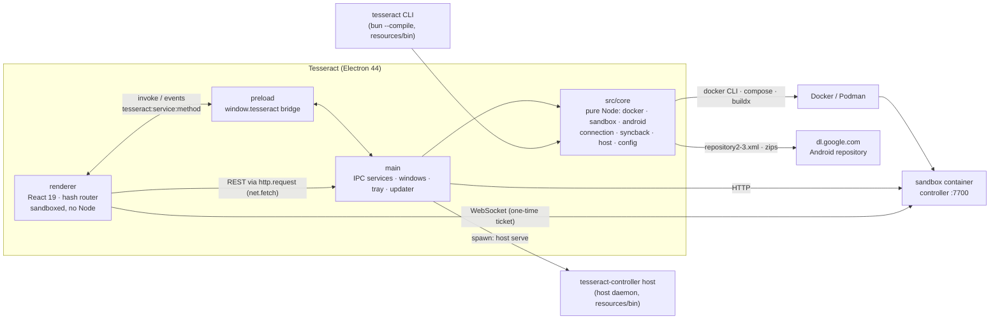
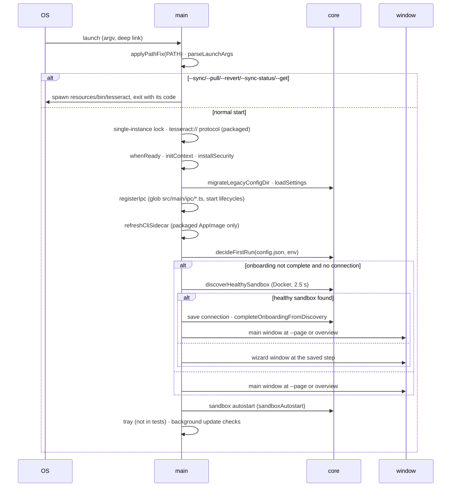
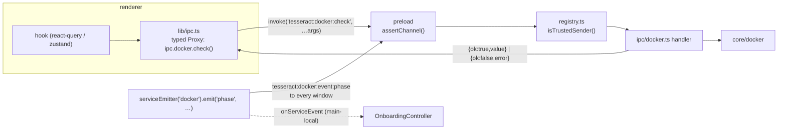
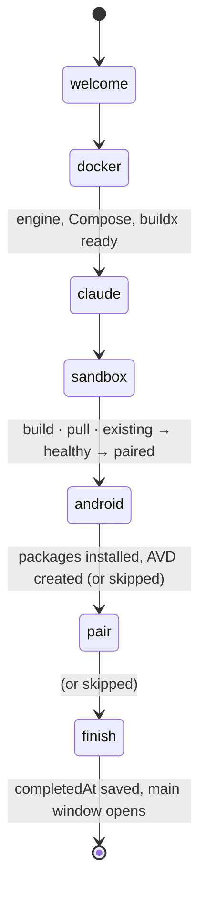

# Electron desktop app (`apps/electron`)

`@tesseract/electron` is the desktop app ("Tesseract", app id `dev.tesseract.Desktop`)
that replaces the GTK4/libadwaita app in `apps/desktop`. It does everything the GTK
app did (overview, agents, projects, files, terminals, display, settings, tray,
sync-back, host shell) and adds what the GTK app left to the README: a setup wizard
that installs or starts Docker, builds or pulls the sandbox image, downloads Android
emulator packages and creates AVDs for the host emulator. It ships as one installer
per OS with a standalone `tesseract` CLI inside.

The decision and its trade-offs are in [ADR 0010](../adr/0010-electron-desktop.md).
Per-screen pixel specs live in [`docs/electron/spec/`](../electron/spec/), the
working rules for contributors in [`docs/electron/conventions.md`](../electron/conventions.md),
and the GTK reference captures in [`docs/electron/reference/`](../electron/reference/).

## 1. Layout and process split

| Path | Runs in | What it holds |
|---|---|---|
| `src/core/<service>/` | main **and** the CLI | Pure Node TypeScript, no `electron` import: `docker`, `sandbox`, `android`, `onboarding`, `connection`, `syncback`, `host`, `claude`, `stt`, `metrics`, `attachments`, plus foundation modules `paths`, `config`, `log`, `process` |
| `src/main/` | Electron main (ESM, Node 24) | `index.ts` (startup), `context.ts`, `app/` (args, deep links, menu, security, lifecycle, local commands), `windows/` (manager, window state, snapshot capture), `ipc/` (one file per service + `_framework/`), `services/` (settings, onboarding controller, tray, updater, CLI install, notifications, idle) |
| `src/preload/index.ts` | preload (CJS, sandboxed) | The `window.tesseract` bridge, nothing else |
| `src/shared/` | everywhere | `ipc.ts` (contract aggregate + channel names), `contracts/<service>.ts`, `routes.ts`, `runtime.ts`, `defaults.ts`. No `node:*` imports |
| `src/renderer/` | renderer (Chromium, no Node) | `app/` (providers, routes, registries, data layer, connection state, command palette, shortcuts, feedback), `shell/`, `pages/<page>/`, `features/<page>/`, `onboarding/<step>/`, `components/<Name>/`, `theme/`, `fixtures/`, `gallery/` |
| `cli/` | `tesseract` binary (Bun) | Command registry, argument parser, `commands/*.ts` that call `src/core` |
| `scripts/` | Node, at build time | `snapshot`, `diff`, `cli-build`, `bundle-sandbox`, `dist`, `smoke`, `make-icons`, `check-nsis-path`, `hooks/after-sign` |
| `e2e/` | Playwright `_electron` | `shell`, `onboarding`, `preferences`, `cli`, `packaging`, `app` (visual) specs |
| `tests/` | vitest (node) | `architecture.test.ts` (import boundaries), `contract.test.ts` (one IPC file per service), `motion-tokens.test.ts` (TS and CSS motion tokens agree) |

The import boundaries are enforced by `tests/architecture.test.ts`: `src/core`,
`src/shared` and `cli` must not import `electron`; the renderer must not import
`node:*`, `src/core` or `electron`; `src/shared` must not import `node:*`. That is
what lets the same core code run in main and in the compiled CLI.

Build: electron-vite 5 + Vite 7 (`electron.vite.config.ts`). Main →
`out/main/index.js` (ESM), preload → `out/preload/index.cjs`, renderer →
`out/renderer/index.html`. All packages are `devDependencies` and bundled, so the
installer ships no `node_modules`. Aliases: `@shared`, `@core`, `@renderer`.

### 1.1 Ports

| Port | Who | Notes |
|---|---|---|
| **4545** | renderer dev server (`bun run dev`, `preview`) | `RENDERER_DEV_HOST`/`RENDERER_DEV_PORT` in `src/shared/runtime.ts`, `strictPort: true` for both `server` and `preview`. Never Vite's 5173 or electron-vite's defaults, so it cannot collide with a project's own dev server or Expo (8081) |
| 7700 | sandbox controller (container) | published on the host as `TESSERACT_CONTROLLER_HOST_PORT` (default 7700), bound to `127.0.0.1` in `local` mode |
| 7701 | host daemon (`tesseract-controller host serve`) | started by the app's host shell service, see [app-runs-and-emulator.md](app-runs-and-emulator.md) |
| 5554–5682 | Android emulator console/adb | first free even port in that range (`EMULATOR_PORT_RANGE`) |

Packaged builds load `file://…/out/renderer/index.html` and open no port at all.

### 1.2 Startup (`src/main/index.ts`)

- Launch flags (`src/main/app/args.ts`): `--hidden`, `--page <id>`, `--quit`, `--debug`,
  the sync flags above, and the internal `--tesseract-snapshot=<json>`.
- `decideFirstRun` (`src/core/onboarding`) skips the wizard when `onboarding.completedAt`
  is set or a connection is already configured (config file or `TESSERACT_*` env).
  Otherwise `adoptDiscoveredSandbox` (`src/main/services/commands.ts`) runs Docker
  discovery with a 2.5 s timeout: a sandbox whose controller answers `/v1/health` is
  saved as the connection and `completeOnboardingFromDiscovery` marks onboarding complete
  (`docker`/`sandbox`/`build` done, the rest skipped), so the main window opens. Without
  one it reopens the wizard at the persisted step. `TESSERACT_DISABLE_DISCOVERY=1` (set by
  the tests) turns discovery off.
- Sandbox autostart (`src/main/services/autostart.ts` over `src/core/sandbox/autostart.ts`)
  runs at every launch, also with `--hidden`: when `sandboxAutostart` is on, it runs
  `docker compose up -d` only for a stack Tesseract created (`sandboxStack.builtAt` set, the
  app's own env file, the env file's project = `sandboxStack.project`). It skips a stack
  that already runs; when Docker is unreachable it shows one notification (click →
  Settings › Sandbox).
- A second launch forwards its arguments to the running instance
  (`second-instance`): `--quit` quits it, `--page`/deep links navigate it, anything else
  shows the window.
- Deep links (`tesseract://<page>?…`, `tesseract://preferences|settings`,
  `tesseract://onboarding|setup`) and tray/menu/notification actions become an
  `AppCommand` delivered to the main window as the `app:command` event.
- Closing the main window hides it while the tray is attached (`shouldHideOnClose`);
  quitting from the tray, menu, OS shutdown or an update install really quits.

### 1.3 Windows

| Kind | Size (min) | Route |
|---|---|---|
| `main` | 1240×800 (360×480), position and maximised state restored from `window-state.json` | `#/<pageId>[/]`, settings as `?preferences=<section>` |
| `onboarding` | 880×620 (760×560), centred, modal over a visible main window | `#/onboarding/<step>` |
| `snapshot` | exact requested content size, hidden | any route, captured with `capturePage()` |

All windows are frameless. macOS uses `hiddenInset` traffic lights at (14, 14);
Linux and Windows draw `WindowControls` in the renderer. The background colour
is set before first paint from the active scheme (`#09090A` dark, `#F5F5F6` light)
so there is no white flash. Zoom is `webContents.setZoomFactor`, persisted as
`zoom` in settings.

Each window receives a `RuntimeInfo` through `additionalArguments`
(`--tesseract-runtime=<json>`: platform, arch, version, window kind, fixtures,
snapshot, appearance override, reduced motion), which the preload exposes as
`runtimeArgv` and the renderer decodes once.

## 2. IPC contract

- **One contract per service** in `src/shared/contracts/<service>.ts`, written as
  `type XContract = DefineContract<{ methods: {…}; events: {…} }>`. `src/shared/ipc.ts`
  aggregates them into `IpcContract` and lists `SERVICE_NAMES`; a compile-time
  assertion fails if one is missing.
- **Channels** are derived, never hand-written: `tesseract:<service>:<method>` for
  invokes, `tesseract:<service>:event:<event>` for events (`invokeChannel`,
  `eventChannel`, `parseChannel`).
- **Handlers**: `src/main/ipc/<service>.ts` exports `defineService(service, handlers, { start })`.
  The handler map type is derived from the contract, so typecheck fails if a method is
  missing. The registry discovers handler files with `import.meta.glob`; nothing is
  registered by hand. `start(emitter)` runs once after registration and may return a
  stop function, called on `will-quit`.
- **Results** cross the boundary as `IpcResult` (`{ ok: true, value }` or
  `{ ok: false, error: { code, message, detail? } }`), never as thrown errors, so the
  renderer gets a typed `IpcError` with one of `not_implemented`, `invalid_argument`,
  `not_found`, `unavailable`, `cancelled`, `forbidden`, `timeout`, `internal`. Any other
  `Error` becomes `internal`. Messages are user-facing strings from label modules.
- **Payloads** are structured-clonable only: plain objects, arrays, strings, numbers,
  booleans, `null`. Dates are ISO strings or epoch ms; bytes are base64.
- **Events** broadcast to every window. State-style events (`onboarding:state`,
  `hostShell:state`, `syncback:state`, `updates:state`, `tray:state`, `window:state`)
  carry the full snapshot, not a diff. Main-side consumers subscribe with
  `onServiceEvent`, which is how the onboarding controller follows `docker`, `sandbox`
  and `android` progress.
- **Renderer**: components never call `ipc` directly; they go through hooks
  (react-query queries/mutations or a zustand store fed by events).

### 2.1 Services

| Service | Methods | Events |
|---|---|---|
| `app` | runtime, paths, settings, updateSettings, openExternal, showItemInFolder, notify, cliStatus, installCli, rendererIdle, quit, relaunch | `command`, `settings` |
| `window` | state, minimize, toggleMaximize, close, setFullscreen, zoom, openOnboarding, openMain, setAccelGuard | `state` |
| `tray` | state, setStatus | `state` |
| `updates` | state, check, download, install | `state` |
| `http` | request(id, req), abort(id) | — |
| `connection` | load, save, forget, discover | `changed` |
| `docker` | check, phase, install, start, cancel, log | `report`, `phase`, `log` |
| `sandbox` | defaults, validate, save, stack, existing, build(mode), cancel, phase, up, down, status, logs, pairing | `phase`, `status`, `log` |
| `android` | support, sdkCandidates, catalog, acceptLicense, install, cancel, accel, avds, createAvd, deleteAvd, emulator, startEmulator, stopEmulator, log | `progress`, `emulator`, `log` |
| `onboarding` | get, goto, skip, dockerCheck/Install/Start, claudeCheck/CreateDir, sandboxSave, buildStart/Cancel, sandboxAdopt, androidCatalog/AcceptLicense/Install/Cancel, androidUseExisting(sdkRoot, avd), pairLoad, finish, openExternal(urlKey) | `state` |
| `syncback` | state, submit, links, snapshots, hostChanges, diff | `state` |
| `attachments` | pick, read (only paths returned by the last `pick`), clipboardHasImage, clipboardHasText, pasteImage | — |
| `files` | download(id, req), saveBytes(name, base64), cancel(id), readClipboard, writeClipboard | `progress` |
| `hostShell` | state, start, stop, refresh, setPin, rotateToken, setAutostart, unlock, lock, androidStatus, startEmulator, stopEmulator, linkSandbox, openEmulatorViewer | `state` |
| `claude` | hostAccounts, ensureConfigDir | — |
| `stt` | microphone, requestMicrophone | — |
| `metrics` | load, save | — |

The contract files are the source of truth; this table is a summary. The
`onboarding` service composes the same core modules that the standalone `docker`,
`sandbox` and `android` services expose to Settings, the projects page and the CLI.
`hostShell` talks to the **host daemon** (PIN session); `android` drives a local
emulator directly, without the daemon.

## 3. Data flow

### 3.1 Sandbox API

The renderer talks to the controller with the same `@tesseract/client` as the phone
app, configured from `connection.load()`:

- **REST** goes through IPC: `ipcFetch` sends `http.request(id, { url, method, headers, body })`;
  main performs it with `net.fetch` (only `http:`/`https:`, 10 min default timeout,
  abortable by id) and returns the body as base64. This sidesteps CORS and keeps
  the controller's origin rules unchanged.
- **Downloads** (artifacts, build outputs) do not go through `http.request`: the
  renderer calls `files.download(id, { url, headers, suggestedName, expectedSha256 })`.
  Main shows the native save dialog, streams the body with `net.fetch` into
  `<target>.tesseract-part` while hashing it, checks the SHA-256 (the artifact's, or the
  `x-content-sha256` header), and only then renames over the target, so a cancelled or
  failed download never truncates an existing file. Progress arrives as
  `files:progress` events. The display's "Save screenshot…" uses `files.saveBytes`.
  The VNC clipboard sync uses `files.readClipboard/writeClipboard`, so it works when the
  window is not focused.
- **WebSockets** (events, terminals, VNC, Android screen) are opened directly from the
  renderer with a one-time ticket in the URL, as on the phone (ADR 0007). The CSP allows
  `connect-src 'self' ws: wss:` for that.
- Server state lives in react-query (`useApiQuery`, keys namespaced by base URL),
  refreshed by the `/v1/events` stream and pollers, the same pattern as ADR 0008.
  `app/connection/` holds the connection state machine (online, offline, re-pair),
  `app/feedback/` the connection banner and recovery toast.

### 3.2 Config and state files

| What | Where | Owner |
|---|---|---|
| `config.json` | `$TESSERACT_DESKTOP_CONFIG`, else `$XDG_CONFIG_HOME/tesseract-desktop/config.json` (`~/.config/…`, shared with the GTK app) on Linux, else `<userData>/config.json` | `src/core/config`: serialized read-modify-write that keeps unknown keys, atomic 0600 write. Keys stay GTK-compatible; Electron adds `onboarding`, `sandboxStack`, `sandboxImageRef`, `sandboxAutostart`, `androidSdkRoot`, `androidAvd` |
| sandbox env file | `<userData>/sandbox/.env` (0600) | `src/core/sandbox` |
| sync-back state | `$XDG_STATE_HOME/tesseract`, else `~/.local/state/tesseract`, `%LOCALAPPDATA%\Tesseract\state` on Windows | `src/core/syncback` (links, snapshots, locks; byte-compatible with the GTK app) |
| caches (Android catalog) | `~/.cache/tesseract-desktop`, `~/Library/Caches/Tesseract`, `%LOCALAPPDATA%\Tesseract\cache` | `src/core/android` |
| Android SDK (default) | `~/.local/share/tesseract/android-sdk`, `~/Library/Application Support/Tesseract/android-sdk`, `%LOCALAPPDATA%\Tesseract\android-sdk` | `src/core/android`; an existing Android Studio SDK is offered first (`sdkCandidates`) |

The app and the CLI resolve all of these through `src/core/paths`, so `tesseract`
on the command line sees exactly what the app sees. Settings changes made by the
CLI are picked up by the app through a file watcher (`watchSettingsFile`).

### 3.3 Setup wizard

Steps (`ONBOARDING_STEP_IDS`): `welcome`, `docker`, `claude`, `sandbox` (with the
`build` id aliased to it), `android` (optional), `pair` (optional), `finish`. Each
step registers itself with `defineOnboardingStep` under `src/renderer/onboarding/<step>/`.

The main-process `OnboardingController` (`src/main/services/onboarding.ts`) owns one
`OnboardingState` (step, per-step statuses, host info, Docker report and phase, Claude
accounts, setup choices, build phase, Android phase and support, pairing info, three log
tails, `completedAt`) and broadcasts it as `onboarding:state` on every change. Logs are
flushed at most every 100 ms. The current step and statuses persist in `config.json`
under `onboarding`, so the wizard resumes where it stopped.

**Docker** (`src/core/docker`). `probeDocker` checks the CLI, daemon, Compose
(≥ 2.24.0), buildx, resources (≥ 2 CPUs, ≥ 4 GiB, 8 GiB wanted), Podman, and on Windows
WSL (≥ 2.1.5); engine ≥ 24.0.0; macOS ≥ 14. Every Docker command has a 15 s timeout.
It recognises Docker Engine, Docker Desktop, rootless, Podman, Colima and OrbStack
contexts. Install options per platform:

| Platform | Options |
|---|---|
| Linux | `engine` (get-docker.sh for Ubuntu/Debian/Raspbian/Fedora/CentOS/RHEL, pacman on Arch, zypper on SUSE, through `pkexec`), `desktop-linux` (docs), `manual` (commands to copy), `docker-group`, `kvm-group` |
| macOS | `desktop` (downloads `Docker.dmg`, sha256-verified, installs with an admin prompt), `manual` |
| Windows | `desktop`, `desktop-user`, `wsl`, `manual` (elevated PowerShell; reboot-required and UAC-cancelled exit codes are handled) |

`startEngine` starts the daemon or Docker Desktop and polls every 2 s (120 s, 180 s on
Windows). At startup `applyPathFix` adds the usual Docker install directories to `PATH`,
because GUI apps on macOS do not inherit the shell's `PATH`.

**Sandbox** (`src/core/sandbox`). The step collects `SetupChoices`: compose project
(default `tesseract`), image (default `tesseract/sandbox:latest`), reachability mode
(`local`, `tailscale`, `host-tailscale`), controller port, CPUs and memory, and the
optional image components, which map to the Dockerfile build args:

| Component | Build arg | Approx. size |
|---|---|---|
| `android` | `WITH_ANDROID` | 0.7 GB |
| `flutter` | `WITH_FLUTTER` (+ `FLUTTER_VERSION`, default 3.47.5) | 1.4 GB |
| `mono` | `WITH_MONO` | 0.4 GB |
| `whisper` | `WITH_WHISPER` (+ `WHISPER_MODELS`, default `base small`) | 0.6 GB |

The base image is about 4.7 GB; `checkDiskSpace` asks for 15 GB plus the components,
rounded up to 5 GB. Chromium is part of the base `desktop` stage, not an option.
`runBuild(mode)` then runs four stages, each resumable after a failure:

1. **preflight** (env file, disk space),
2. **image**: `build` runs `docker buildx build --progress=rawjson --target sandbox --load`
   against the bundled build context and turns BuildKit's JSON into a weighted progress
   bar (`BuildProgress`, weights from `build-weights.json`); `pull` pulls
   `sandboxImageRef` through the Docker Engine API socket (`PullProgress`); `existing`
   reuses an image or container found by `findExisting`,
3. **up**: `docker compose up -d` with the compose files for the chosen mode,
4. **health**: polls `GET /v1/health` (every 2 s, 180 s) and finally **pairs**: reads the
   pairing info from the container, saves the connection to `config.json` and records
   the build.

The phase (`preflight`, `building`, `pulling`, `starting`, `waiting`, `pairing`, `done`,
`failed`, `cancelled`) is broadcast as `sandbox:phase`. `TESSERACT_*` and `COMPOSE_*`
variables from the app's environment are scrubbed before Docker runs.

**Android** (`src/core/android`). Like Android Studio's SDK manager, without
`sdkmanager` or a JDK:

1. `loadCatalog` downloads `repository2-3.xml` and the `google_apis` `sys-img2-3.xml`
   from `dl.google.com` (cached 6 h; `TESSERACT_ANDROID_REPOSITORY_URL` /
   `TESSERACT_ANDROID_SYSIMG_URL` point at a mirror, a full `.xml` URL or a base URL,
   `http(s)` only), and offers `emulator`, `platform-tools` and the
   system images for the host ABI (default API 36).
2. Licences are shown in full and recorded in `<sdk>/licenses/` exactly as `sdkmanager`
   would.
3. `installPackages` downloads each zip with resume (`Range`), 3 retries and a 30 s idle
   timeout, verifies the SHA-1 from the repository, extracts with file modes and
   symlinks, writes `package.xml`, and swaps the package into place atomically. It
   checks for 3× the download size of free space first.
4. `checkAcceleration` probes `/dev/kvm` and `emulator -accel-check` on Linux, WHPX
   (`HypervisorPlatform` optional feature) on Windows and `kern.hv_support` (HVF) on
   macOS, and turns the result into a hint (CPU, not installed, missing device,
   disabled, permission, ioctl).
5. `writeAvd` creates the AVD (`config.ini`, `<name>.ini`) from an `AvdSpec`: RAM and
   cores sized to the host (2 or 4 GB, 2–4 cores), a device profile (`pixel_5` default,
   `pixel_8`, `medium_phone`, `pixel_tablet`; `DEVICE_PROFILE_CONFIG` gives
   `hw.device.*`, `hw.lcd.*` and `skin.name`) and internal storage (2–64 GB, default
   6 GB → `disk.dataPartition.size`). `androidSdkRoot` and `androidAvd` are saved, and
   the host daemon gets `TESSERACT_ANDROID_SDK_ROOT` and `TESSERACT_ADB` from them, so the
   **host emulator** of [app-runs-and-emulator.md](app-runs-and-emulator.md) uses this SDK.

### 3.4 Sync-back and the host daemon

- `SyncBackService` (`src/core/syncback`, run by `src/main/ipc/syncback.ts`) is the
  TypeScript port of the GTK `services/syncback.py`: it opens the controller's
  `/v1/events` stream from main, sends a heartbeat every 20 s while online, applies pending
  sync requests one at a time, and shows a notification per result (click → the
  project). It reconnects when `config.json` changes (polled every 5 s).
- The host shell service (`src/core/host`, `src/main/ipc/hostShell.ts`) spawns
  `tesseract-controller host serve` (bundled binary in packaged builds, the repo's
  controller in development; `TESSERACT_CONTROLLER_COMMAND` overrides it), reads its
  pairing info, manages the PIN, token rotation and autostart, and proxies the host
  Android API (status, start/stop emulator, link the sandbox, open the viewer). On
  Linux the child gets `setpriv --pdeathsig TERM` so it dies with the app.

## 4. CLI

`tesseract` is `cli/index.ts` compiled with `bun build --compile --minify` per target
(`bun run cli:build`), next to `tesseract-controller` (the controller compiled from
`apps/controller`). Both go to `dist-cli/<os>-<arch>/` and ship in `resources/bin`.

| Command | Does |
|---|---|
| `status` | connection, Docker, stack and Android emulator at a glance |
| `open [page]` | opens or focuses the app on a page (falls back to a `tesseract://` link) |
| `doctor [docker\|image\|kvm\|sdk]…` | the wizard's checks, as a report |
| `sandbox status\|up\|down\|restart\|logs\|build\|pair` | the stack (`build --with android,flutter,mono,whisper\|all\|none [--pull\|--existing]`) |
| `android images\|install\|avd list\|create\|start\|delete` | the SDK and AVDs |
| `pair [--no-qr]` | pairing link and a terminal QR code for the phone |
| `sync [push\|pull\|revert\|status]` and the GTK flags `--sync`, `--pull`, `--revert`, `--sync-status` | sync-back from the current directory |
| `--gemini-key=KEY` | saves the Gemini API key for voice notes on the connected sandbox (`PUT /v1/stt`); same as Preferences → Speech-to-text |
| `config path\|get\|set\|unset` | `config.json` (the token is redacted unless `--reveal`) |
| `version` | the app version |

Global flags: `--json` (machine-readable stdout, errors as `{ ok: false, error: { code, message } }`),
`--verbose`, `--help`. The desktop executable itself accepts the sync flags and
forwards them to the bundled CLI (`src/main/app/local-command.ts`), so `.desktop`
actions and old scripts that call the app with `--sync` keep working.

## 5. Renderer

- **Routes** (hash router): `#/<pageId>[/]` for the shell pages `overview`, `agents`,
  `projects`, `files`, `terminals`, `display`; `?preferences=<section>` opens Settings
  over the shell (`connection`, `appearance`, `claude`, `host-shell`, `stt`, `sandbox`,
  `android`, `about`); `#/onboarding/<step>`; `#/gallery[/<entry>]` for the component
  gallery. Any route accepts `?fixtures`, `?scheme=light|dark` and `?scenario=<name>`.
- **Registration** without index files: `definePage`, `definePreferencesSection`,
  `defineOnboardingStep`, `defineGalleryEntry`, discovered with `import.meta.glob`.
  The registry tests check ids and order against `src/shared/routes.ts`.
- **Components** live in `components/<Name>/` (component file, CSS module, `labels.ts` /
  `constants.ts`, `index.ts`, gallery entry). Page logic is in `features/<page>/`
  (labels, constants, model, hooks); `pages/<page>/` holds only the page and its views.
- **Command palette** (`app/palette/`) and global shortcuts (`app/shortcuts/`) replace
  the GTK accelerators.

### 5.1 Fixtures

Fixture mode is on with `TESSERACT_FIXTURES=1`, `?fixtures`, in snapshots, in vitest and
in a plain browser (no preload). Then `@tesseract/client` uses `fixtureFetch` (routes keyed
by `@tesseract/protocol` route patterns), sockets are `FixtureSocket`s that replay frames,
and IPC methods can be overridden per method (`defineIpcFixtures`); methods without a
fixture fall through to the real bridge, so window controls still work. `fixtures/base/`
is the shared world (projects `streaxfit`, `tesseract`, `hybrid-pos`,
`sante-production`, sandbox `tesseract-sandbox`); `fixtures/<area>/` adds page data and
named scenarios (`?scenario=offline`). This is what the snapshot, visual e2e and gallery
runs render.

## 6. Theme and motion

The theme is a port of the GTK app's Linear-style "graphite" theme
([theme.md](../electron/spec/theme.md)):

- **Tokens** (`theme/tokens.css`, `--to-*`): dark `graphite` and light `graphiteLight`
  schemes on `<html data-scheme>`. Dark: background `#09090A`, surface (inset)
  `#121213`, elevated (dialogs) `#1A1A1B`, selection `#232325`, accent `#5E6AD2`
  (strong `#9EA6F0`), text `#E3E3E4` / `#929294` / `#6B6B6F`. Radii 4/6/8/10/12 px
  (`card` 10, `sheet` 12, `pill`). Canvases (charts, xterm, sparklines) read the same
  palette from `theme/palettes.ts` through `useScheme()`.
- **Type**: Inter (13 px base), Inter Display for titles, Geist Mono for code and
  terminals, bundled from the GTK app's fonts with `font-display: block`; their licences
  ship in `resources/licenses`.
- **Icons**: lucide-react pinned to 1.52.0 (the same glyph set the GTK app renders),
  mapped by app icon name in `theme/icons.ts`; framework logos as SVGs in `theme/logos/`.
- **Platform**: `data-platform` and `data-window` attributes; the drag regions use the
  global `to-drag` / `to-no-drag` classes.

**Motion** (`theme/motion.ts`, mirrored as `--to-duration-*` / `--to-ease-*`, kept in
sync by `tests/motion-tokens.test.ts`):

| Token | Value |
|---|---|
| durations | fastest 60, fast 120, normal 180, slow 260, slower 400, slowest 720 ms |
| easings | standard `(0.2, 0, 0, 1)`, decelerate, accelerate (exits), overshoot `(0.34, 1.56, 0.64, 1)` |
| press scale | controls 0.95, cards 0.98 |
| presets | `fade`, `pageEnter` (x 24→0), `stepForward` / `stepBackward` (wizard), `popover` and `dialog` (scale 0.98→1), `toast` (y 8), `rise` (y 4, rows), `reveal` (height auto), `stagger` for lists (capped) |
| loops | pulse 2880 ms (live dots), shimmer 1440 ms (indeterminate bars), spinner 1000 ms |

UI transitions stay within 120–260 ms; enters ease out, exits use the shorter
accelerate curve. Reduced motion is respected twice: `MotionConfig reducedMotion="user"`
for motion components, and `prefers-reduced-motion` (or `data-reduced-motion="true"`)
collapses every CSS duration to 0 and the press scale to 1. Spinners keep turning.
Snapshot windows always run with reduced motion, so captures are deterministic.

### 6.1 Pixel matching

`bun run snapshot -- --route <route> --out x.png [--light] [--width --height]` builds if
stale, starts Electron with `--ozone-platform=headless` (nothing appears on screen), a
temporary profile under `$TMPDIR/tesseract-test-*` and fixtures on, waits for
`window.__tesseractIdle()` (fonts loaded, no queries in flight, no finite animation for
300 ms) and writes a PNG at device scale 1. `bun run diff -- a.png b.png --out d.png`
compares it with pixelmatch against the GTK captures in `docs/electron/reference/`
(1024×768, zoom 1). The visual e2e spec keeps its own baselines in
`e2e/__snapshots__/`.

## 7. Security model

The renderer shows content from the sandbox (agent transcripts, file names, logs,
terminal output), which is untrusted. The design keeps it away from Node and the host:

- Every window: `sandbox: true`, `contextIsolation: true`, `nodeIntegration: false`,
  no `<webview>` (`will-attach-webview` is refused).
- The preload exposes only `invoke`, `on`, `getPathForFile` and the runtime argv on
  `window.tesseract`, and rejects any channel that `parseChannel` does not recognise.
- Main answers IPC only from trusted frames: the packaged `file://…/index.html` or,
  in development, the `ELECTRON_RENDERER_URL` origin (`http://127.0.0.1:4545`).
  Anything else gets `forbidden`.
- Navigation away from the app is blocked; `window.open` is denied. Links open in the
  system browser only for `http:`, `https:` and `mailto:`.
- Permission requests are allowed only for `media` (voice notes), clipboard read and
  sanitized write, `fullscreen`, `notifications`, `pointerLock` and `keyboardLock`.
- CSP (`index.html`): `default-src 'self'`, scripts from `'self'` only,
  `connect-src 'self' ws: wss:`, `object-src 'none'`, `base-uri 'none'`.
- `http.request` refuses anything but `http:`/`https:` and runs in main with
  `net.fetch`; the renderer never gets raw sockets to the host.
- Electron fuses: `runAsNode`, `NODE_OPTIONS` and `--inspect` off,
  `onlyLoadAppFromAsar` on.
- Secrets: the sandbox token reaches the renderer (the client needs it, as on the
  phone). The host daemon token, PIN, PIN session and `TS_AUTHKEY` stay in main and are
  redacted from logs (`redact()`, `LogRing`). On macOS and Windows the sandbox token in
  the default `config.json` is sealed with `safeStorage`; on Linux it stays in the
  0600 file for compatibility with the GTK app and the CLI. In `tailscale` mode `TS_AUTHKEY` is
  blanked in the env file after `compose up`.
- Child processes run through `runCommand(file, args)` (`execFile` with argument
  arrays, never a shell). Privileged steps go through the OS prompt (`pkexec`,
  `osascript … with administrator privileges`, UAC); the app itself never runs as root.

The sandbox's own trust boundaries are unchanged; see
[security-model.md](security-model.md).

## 8. Packaging and updates

`bun run dist [-- --platform linux|mac|win] [--dir]` runs `build`, `cli:build` for the
platform's targets, `bundle:sandbox`, then electron-builder with
`electron-builder.yml`:

| OS | Artifacts | CLI on `PATH` |
|---|---|---|
| macOS | universal `dmg` (+ `zip` for updates), hardened runtime, entitlements, min macOS 12; notarized in `afterSign` when `TESSERACT_NOTARIZE` and Apple credentials are set | in-app "Install tesseract command": admin prompt, `/usr/local/bin/tesseract` → `resources/bin/tesseract` (refused when the app runs translocated, outside `/Applications`) |
| Windows | per-user one-click NSIS (`x64`), no elevation, desktop and Start-menu shortcuts | `build/installer.nsh` adds `$INSTDIR\resources\bin` to the user `Path` and removes it on uninstall |
| Linux | `AppImage` and `deb` (`x64`); the deb recommends `docker.io \| docker-ce` (Podman is refused by the Docker step) | deb `postinst` links `/usr/bin/tesseract` only when the path is free or already ours; AppImage: in-app install copies the CLI to `~/.local/share/tesseract/bin` and links `~/.local/bin/tesseract`; on install and every AppImage launch `src/main/services/cli-sidecar.ts` writes `~/.local/share/tesseract/app.json` `{appPath, sandboxDir}` and syncs the bundled sandbox context to `~/.local/share/tesseract/sandbox` (marker `.bundle-hash`), so the copy finds the app and the context |

`extraResources`: `dist-cli/${os}-${arch}` → `resources/bin`,
`build/sandbox-context` → `resources/sandbox` (the git-tracked files needed to build
the image: Dockerfile, rootfs, compose files, controller and protocol sources, plus
`manifest.json` with the commit and a `dirty` flag, and `build-weights.json`), icons,
font licences. The packaged app builds the image from `resources/sandbox`; a
development build uses the repository itself. The `tesseract://` scheme is registered
by the installers.

**Updates** use electron-updater against a generic feed
(`https://downloads.tesseract.dev/desktop`). Main checks 60 s after start and then
every 6 h, downloads in the background, then shows a notification and a tray item
("restart to update"); the update installs on quit. Updates are off in development,
in tests, with `TESSERACT_DISABLE_UPDATES=1`, and for Linux installs that are neither
the AppImage nor an electron-builder package (no `resources/package-type`); those
show "Update Tesseract with your package manager".

## 9. Tests

| Suite | Command | Covers |
|---|---|---|
| unit (node) | `bun run test` | `src/core`, `src/shared`, `cli`, `scripts/lib`, architecture and contract tests; no display, no Docker |
| unit (renderer) | `bun run test` | components, hooks, pages and the wizard in happy-dom with fixtures |
| e2e | `bun run e2e` | Playwright `_electron`, headless on Linux, isolated profile: shell, wizard (real Docker detection, a simulated build, Android install from a local repository into a temporary SDK, finish), settings, CLI (exit codes, JSON, config, doctor, sandbox, pair, open), packaging (builder config, NSIS PATH macros under wine, AppImage contents and launch), visual snapshots |

Docker resources created by tests use `tesseract-test-` names (or the e2e harness's
`tesseract-e2e` stack) and are removed afterwards; the user's `tesseract` stack and the
daemon on 7701 are never touched. Host-shell e2e runs use a free port and a temporary
directory. See [../runbooks/e2e-testing.md](../runbooks/e2e-testing.md) for the
repository-wide suites.
