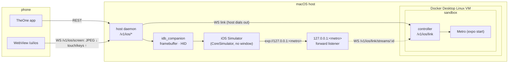

# iOS Simulator and Android emulator on a macOS host

> **Status: proposal (2026-10-06). Nothing here is implemented.** Names, paths and
> messages below are a draft; when the work starts they move into the
> [blueprint](00-blueprint.md) and [app-runs-and-emulator.md](app-runs-and-emulator.md)
> together with the code. Items marked **(spike)** must be verified on a real Mac first.

Goal: when the Docker host is a Mac, the phone can see and drive an **iOS Simulator**
(and the Android emulator) the same way it drives the host Android emulator today: a
JPEG frame stream down, touch / keys / text up, and the sandbox can run the project's
app on it.



## 1. Constraints

- **The Simulator only runs on macOS with Xcode.** On a Mac, Docker runs containers
  in a Linux VM, so the sandbox can never run the Simulator, `simctl` or `xcodebuild`.
  A host-side component is required, exactly as for the host Android emulator
  (`theone-controller host serve`, §5.7 of the blueprint). The host daemon is a Bun
  binary and runs on macOS unchanged; only the `android/netns*` parts are Linux-only.
- **No KVM in the sandbox on a Mac.** Docker Desktop's VM does not reliably expose
  nested virtualization, so the Android emulator cannot run in the sandbox either.
  It keeps running on the host (§5).
- **No `netns` isolation on macOS.** `unshare` and network namespaces do not exist.
  The Simulator (and a host Android emulator) share the Mac's network stack, i.e.
  only the equivalent of today's `THEONE_EMULATOR_ISOLATION=none` is possible (§4).
- **No public API for live frames or input.** `xcrun simctl` can boot, install,
  launch, open URLs, take screenshots and record video to a file, but it cannot
  stream frames and cannot tap, swipe or type.

## 2. Screen and input

### 2.1 Options

| Option | Frames | Input | Window needed | Cost / risk |
|---|---|---|---|---|
| **A. `idb_companion`** (Meta, MIT) | `idb video-stream --format mjpeg\|h264` from the simulator framebuffer | HID injection: tap, swipe, text, HID keys, hardware buttons | no | private CoreSimulator / SimulatorKit APIs, can break with an Xcode release; maintenance is uneven |
| B. Own Swift helper on the same private APIs | framebuffer surface → JPEG | `SimDeviceLegacyHIDClient`-style HID, true down / move / up | no | full control (Radon IDE ships this approach), but we own the private-API breakage |
| C. ScreenCaptureKit + `CGEvent` | capture of the Simulator.app window | synthetic mouse clicks into the window | yes, on screen and focused | public APIs, but Screen Recording + Accessibility permissions, focus stealing, window chrome |
| D. WebDriverAgent (XCUITest, as Appium) | WDA MJPEG server | XCTest gestures, multi-touch | no | needs a built and signed test runner per Xcode; heavy |
| E. macOS VM (Tart / UTM / Lume) + Screen Sharing | whole VM desktop over VNC | VNC mouse and keyboard | yes | simplest and best isolated, reuses `/ui/vnc`; desktop instead of a phone-shaped view, heavy on RAM |

**Decision: A first, B if idb is not good enough, E as the documented fallback.**
A maps almost one to one onto the Android protocol, needs no Simulator window and no
macOS privacy permissions. C and D are not pursued.

### 2.2 Frame stream (option A)

One session per booted device while at least one `/v1/ios/screen` viewer is open,
fanned out like the Android session (blueprint §5.7, app-runs-and-emulator §2.4):

```
idb_companion --udid <udid> --grpc-port <free port>          # started by the daemon, own process group
idb video-stream --udid <udid> --format mjpeg --fps 30 \
  --compression-quality 0.6 --scale-factor <s>                # JPEG frames on stdout (spike: flags, stdout)
```

- JPEG frames are split on SOI / EOI and sent as binary messages, same as Android
  (no ffmpeg needed with `mjpeg`; with `h264` reuse the existing ffmpeg pipeline).
- `<s>` is chosen so the long side is at most the first viewer's `maxSize`
  (default 1280). The same rules apply: shared session, last frame for late viewers,
  frames skipped above 512 KiB `bufferedAmount`, session ends with the last viewer.
- `meta` / `size` carry the frame size in **pixels** and the device size in
  **points** (`simctl` / idb input is in points; spike: confirm for each device scale).

### 2.3 Input

The client protocol stays the Android one so the page code is shared:

| Client message | idb | Notes |
|---|---|---|
| `touch` down / move / up | idb gRPC `hid` stream: touch down at (x, y), move, up | the `idb ui tap` / `ui swipe` CLI only does whole gestures, so live dragging needs the gRPC HID stream **(spike)**; points = pixels / scale |
| `scroll` | converted to a short swipe at (x, y) | no wheel on iOS |
| `key` `home` / `power` | `ui button HOME` / `ui button LOCK` | `back` and `app_switch` hidden on iOS (`app_switch` could be double HOME) |
| `key` `enter` `del` `tab` `escape` arrows | `ui key <HID usage>` | HID usage ids, not Android keycodes |
| `key` `volume_up` / `volume_down` | not supported, ignored | |
| `text` | `ui text "<text>"` | ≤ 300 UTF-8 bytes like Android; idb types through the hardware keyboard, so non-ASCII may need the pasteboard (`simctl pbcopy` + Cmd-V) **(spike)** |
| `rotate` | not in `simctl`; idb or a private orientation call **(spike)** | hidden until verified |

**Multi-touch** (pinch / rotate) is not supported in the first version: one pointer
per device, other pointers are dropped. The Simulator itself only does two-finger
gestures by mirroring, so B or D would be needed for real multi-touch.

### 2.4 Pages

`/ui/ios` = `/ui/android` with an iOS bottom bar (○ home, ⏻ lock, ⌨ keyboard) and
`ios-state` / `ios-need-ticket` bridge messages. Prefer one parameterised page
(`/ui/device?kind=ios|android`) over a copy.

## 3. Running the project's app

### 3.1 Metro reachability (reverse tunnel)

The Simulator must load the JS bundle from Metro in the sandbox. The adb tunnel runs
sandbox → host; this one runs **host → sandbox**:

- The sandbox link (same shape as the Android link: host dials
  `WS <sandboxUrl>/v1/ios/link`) announces the run's Metro port.
- The daemon listens on `127.0.0.1:<port>` **on the Mac** and, per accepted TCP
  connection, opens `WS <sandboxUrl>/v1/ios/link/streams/:id?ticket=&port=<port>`;
  the controller pipes it to `127.0.0.1:<port>` in the sandbox. The controller only
  accepts ports that belong to a running `*-ios` app run (no generic port forward).
- Alternative without a tunnel: if the Mac is on the tailnet, the Simulator can use
  the sandbox Tailscale address directly (as `expo-device` does for the phone). The
  tunnel is preferred because it works without tailnet ACL changes and keeps
  Metro off the LAN.

### 3.2 Run targets

| Target | Offered when | Command (sandbox) | Host side | Viewer |
|---|---|---|---|---|
| `expo-ios` | framework `expo`, iOS link connected and a device `Booted` | `npx expo start --go --port $P` with `CI=1` | install Expo Go if missing, then `simctl openurl <udid> exp://127.0.0.1:$P` | `ios` |
| `expo-ios-dev-client` (phase 2) | framework `expo` with `expo-dev-client` | `npx expo start --dev-client --port $P` | install a **simulator build** `.app` (§3.3), then open the dev-client URL | `ios` |

The sandbox never runs `simctl`. It sends typed requests over the link
(`{type:"openUrl", url}` restricted to `exp://127.0.0.1:<run port>` and the app's
scheme; `{type:"install", artifactId}`), and the daemon decides. Expo Go comes from
Expo's published simulator build (the same one Expo CLI downloads), fetched by the
daemon, never supplied by the sandbox.

### 3.3 Native builds

The sandbox cannot run `xcodebuild`. Native simulator builds come from:

- an **EAS simulator build** (`"ios": {"simulator": true}` profile) — the user's Expo
  account, cloud build, `.tar.gz` with an `.app`; downloaded into the sandbox as an
  artifact, then handed to the host; or
- `xcodebuild` **on the Mac**, run by the user (out of scope for the daemon).

**Installing an `.app` from the sandbox runs native code on the Mac.** Simulator apps
are ordinary macOS processes under the user's account with a weak sandbox (they can
read much of the user's file system and use the Mac's network). So `install` of a
sandbox-supplied `.app` requires an explicit confirmation on the phone (host API,
session auth) for every new bundle hash; Expo Go + JS bundle is the default path.

## 4. Security

Compared with the Linux host Android emulator in `netns` mode, a Mac host is weaker:

| Exposure | Linux host (`netns`) | macOS host |
|---|---|---|
| Guest / app reaches host loopback, LAN, tailnet | no (filtered proxy) | **yes**: JS in Expo Go (and any native app) uses the Mac's network |
| Sandbox reaches a host debug channel | adbd only, inside the netns | none: only typed link requests (`openUrl`, `install`) |
| Native code from the sandbox on the host | runs inside the emulator VM | **runs on the Mac** if an `.app` is installed (§3.3, confirmation required) |

Rules:

- iOS support is **off by default** (`THEONE_IOS=1` on the daemon) and
  `GET /v1/ios` reports `isolation: "none"`; the app shows a warning like the
  `none` Android mode.
- The sandbox never gets `simctl`, idb's gRPC port or a host shell. idb_companion
  listens on loopback with a random port and is only used by the daemon.
- The reverse tunnel only forwards to ports of running `*-ios` app runs, and only
  while the run lives.
- For untrusted or confidential projects, document option E (a macOS VM) as the
  isolated setup: Simulator and Xcode inside the VM, viewed through `/ui/vnc`.

## 5. Android emulator on a Mac host

The host daemon's Android support works on macOS with these changes:

- SDK: Android Studio's default `~/Library/Android/sdk` added to the
  `THEONE_ANDROID_SDK_ROOT` search; Apple Silicon needs `arm64-v8a` system images
  (the emulator uses Hypervisor.framework, no KVM).
- `THEONE_EMULATOR_ISOLATION` defaults to `none` on macOS and `netns` reports
  `available: false` with `Network isolation needs Linux`. Today `*-android` run
  targets require `isolated: true`; on macOS that requirement becomes an explicit
  opt-in (`THEONE_EMULATOR_ALLOW_UNISOLATED=1`), shown as a warning in the app.
- scrcpy, ffmpeg and the screen stream are unchanged (Homebrew paths added to the
  `THEONE_SCRCPY_SERVER` search: `/opt/homebrew/share/scrcpy/scrcpy-server`).
- `-gpu swiftshader_indirect` stays the default; `host` (Metal) is faster on a Mac
  and worth offering.

## 6. Draft types and API (host daemon, session auth)

```ts
SIM_STATES = ["unavailable","shutdown","booting","booted","shutting_down","failed"]
SimDevice { udid, name, runtime: string /* "iOS 26.0" */, state, widthPt, heightPt, scale }
HostIosStatus { available: boolean, reason: string | null, xcode: string | null, idb: boolean,
                isolation: "none", devices: SimDevice[], booted: SimDevice | null, link: IosLinkInfo }
BootSimulator { udid }
```

| Method | Path | Response |
|---|---|---|
| GET | `/v1/ios` | `HostIosStatus` (`available:false` + reason without macOS / Xcode / idb) |
| POST | `/v1/ios/simulator` | `BootSimulator` → `202 SimDevice` (`simctl boot`, poll `bootstatus`) |
| DELETE | `/v1/ios/simulator` | `SimDevice` (`simctl shutdown`) |
| POST / DELETE | `/v1/ios/link` | like `/v1/android/link` |
| WS | `/v1/ios/screen?ticket=&maxSize=` | §2.2 / §2.3 |
| GET | `/ui/ios` | the screen page |

Controller side: `GET /v1/ios` (`SandboxIosStatus { linked, hostId, booted }`), the
link and stream endpoints of §3.1, and run targets of §3.2.

## 7. Plan

1. **Spike on a Mac** (½–1 day): idb `video-stream` to stdout at 30 fps, latency
   through the existing JPEG page; gRPC HID touch down / move / up; text with
   non-ASCII; rotation; behaviour across an Xcode update.
2. Host daemon `host/ios/` (status, boot / shutdown, screen session) + `/ui/ios`
   (shared device page). Mobile: a "Simulator" entry next to the Android emulator.
3. iOS link + reverse Metro tunnel + `expo-ios` run target.
4. Android on macOS (§5).
5. Phase 2: `expo-ios-dev-client` with EAS simulator builds and install confirmation.

If the spike shows idb is unreliable, switch to option B (own helper) for frames and
input, or ship option E only.
