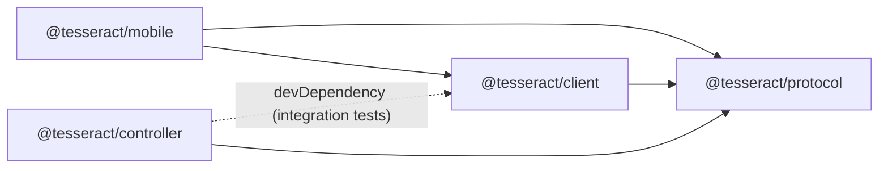

# Monorepo

One repository holds the phone app, the daemon that runs in the sandbox, the
shared wire contract, and the infrastructure that builds and runs the sandbox.
Rationale: [ADR 0001](../adr/0001-monorepo-bun-workspaces.md).

## Layout

```text
apps/
  mobile/        @tesseract/mobile      Expo SDK 56, React Native 0.85, expo-router
  controller/    @tesseract/controller  Bun + Hono daemon, compiled to one binary
packages/
  protocol/      @tesseract/protocol    zod v4 schemas, types, constants, URL/pairing helpers
  client/        @tesseract/client      typed REST/WS client (React Native, browser, Bun)
infra/
  docker/sandbox/  Dockerfile + rootfs/ (supervisord, entrypoint, templates, openbox)
  compose/         compose*.yml, tailscale/serve.json, .env.example
  scripts/sandbox  operator CLI (bash)
  tests/           bats suites for the operator CLI, rootfs scripts and compose files
  e2e/             end-to-end suite against a real local stack (not a workspace)
examples/
  electron-hello/  Electron + electron-builder fixture for build tests (not a workspace)
docs/            architecture/, adr/, runbooks/, archive/
SPEC.md          operating spec for Claude inside the sandbox
```

Workspaces are declared in the root `package.json` as `apps/*` and
`packages/*`. `examples/` is deliberately outside them. Its dependencies
(Electron, electron-builder) are never installed on the host. The example is
copied into the sandbox and built there.

## Dependency graph



`@tesseract/protocol` depends only on `zod`; its `./bridge` subpath (WebView
message names) is zod-free so the controller's browser pages can import it.
`@tesseract/client` depends only on `@tesseract/protocol` and platform globals
(`fetch`, `WebSocket`), which is why the same code runs in React Native,
browsers and Bun. The controller uses `@tesseract/client` only in tests
(`tests/client-integration.test.ts` runs every client method against a real controller).

## Why bun with the hoisted linker

- **bun** installs quickly, runs TypeScript directly (controller, tests), and
  its `bun build --compile` produces the single controller binary shipped in
  the image. One tool on the host and in the Docker build stage.
- **`linker = "hoisted"`** (`bunfig.toml`): React Native, Metro and several
  Expo config plugins resolve native packages by walking `node_modules`.
  Bun's isolated linker (the default for new workspaces) hides transitive
  dependencies and breaks those lookups. Hoisting gives the flat layout that
  Expo documents as the safest option.
- **One `react` / `react-native` version.** Expo does not support duplicate
  React Native versions in a monorepo. Only `apps/mobile` depends on React
  Native. The shared packages have no React dependency at all.

## TypeScript-source packages

Internal packages have no build step. Their `package.json` points straight at
the source:

```json
{ "main": "./src/index.ts", "types": "./src/index.ts", "exports": { ".": "./src/index.ts" } }
```

- Metro transpiles them for the app, Bun runs them natively, and
  `bun build --compile` bundles them into the controller binary.
- They MUST stay platform-neutral: no Node built-ins, no Bun APIs, no React
  Native imports. Use `globalThis.crypto`, `fetch` and `WebSocket`.
- `tsconfig.base.json` holds shared strict options (`strict`,
  `noUncheckedIndexedAccess`, `verbatimModuleSyntax`, `moduleResolution: Bundler`).
  Non-Expo packages extend it. `apps/mobile` extends `expo/tsconfig.base`.

## Scripts

Run from the repository root:

| Command | What it does |
|---|---|
| `bun install` | install all workspaces (hoisted) |
| `bun run typecheck` | `tsc` in every workspace (`bun run --filter '*' typecheck`) |
| `bun run test` | tests in every workspace (bun test, or jest for mobile) |
| `bun run lint` | lint where configured (`expo lint` in `apps/mobile`) |
| `bun run mobile` | `expo start` in `apps/mobile` |
| `bun run controller:dev` | controller with `--watch` on the host, for development (set `TESSERACT_HOST=127.0.0.1` and `TESSERACT_WORKSPACE`, see [controller.md](controller.md#development)) |
| `bun run controller:build` | `bun build --compile` → `apps/controller/dist/tesseract-controller` |
| `bun run sandbox <cmd>` | operator CLI: `up`, `down`, `restart`, `logs`, `shell`, `pair`, `doctor`, `build`, `status`, `ps`, `config` (plus `--mode`, `--dind`, `--env-file`) |
| `bun run test:infra` | bats suites for `infra/` in throwaway containers ([infra/tests](../../infra/tests/README.md)) |
| `bun run e2e` | end-to-end suite against an isolated `tesseract-e2e` stack ([e2e-testing](../runbooks/e2e-testing.md)) |

Every workspace package MUST define `typecheck` and `test`. `infra/e2e` is not a
workspace: typecheck it with `bunx tsc -p infra/e2e/tsconfig.json`.

## Adding things

**A dependency**: run `bun add <pkg>` inside the package directory, not at the
root. For Expo native modules use `bunx expo install <pkg>` in `apps/mobile`,
which picks the SDK-compatible version. Automated agents working in parallel
MUST wrap installs in `flock /tmp/tesseract-bun-install.lock …` so that two
installs never rewrite `bun.lock` at once.

**A package**:

1. Create `packages/<name>/` with `package.json` (`"name": "@tesseract/<name>"`,
   `"private": true`, `"type": "module"`, source `exports`, `typecheck` and
   `test` scripts) and a `tsconfig.json` that extends `../../tsconfig.base.json`.
2. Consume it with `"@tesseract/<name>": "workspace:*"` and run `bun install`.
3. If the controller uses it, check that the `controller-build` stage in the
   Dockerfile copies the new package directory.

**A protocol change**: update the blueprint, then the zod schema in
`packages/protocol`, the controller route, `@tesseract/client`, and
[protocol.md](protocol.md), all in one change.

## Expo and Metro in the monorepo

- Since SDK 52, `expo/metro-config` detects workspaces automatically (watch
  folders, `node_modules` resolution). The app needs no custom
  `metro.config.js` for the shared packages.
- From SDK 55, autolinking and Metro resolve native modules the same way in
  monorepos, which prevents two copies of one native module being linked.
- Run Expo commands from `apps/mobile` (`bun run mobile` does that).
  `bunx expo install --check` validates native module versions against the SDK.
- `react-native-webview` and `expo-camera` contain native code, so the app
  needs a development build (`expo run:android` / `expo run:ios`, or an EAS
  development build). Expo Go may lack the exact module versions. See
  [mobile-app.md](mobile-app.md#dev-build-requirement).
- Generated native folders (`apps/mobile/android`, `apps/mobile/ios`) are
  gitignored (continuous native generation).

## Controller packaging

The `controller-build` stage of the sandbox Dockerfile uses the repository
root as its context. It copies the manifests, runs a filtered
`bun install --frozen-lockfile`, and runs the controller's `build` script
(`bun build src/index.ts --compile --minify --sourcemap`), which compiles for
the platform the stage runs on (the image's platform; no `--target`).
The resulting self-contained binary becomes `/usr/local/bin/tesseract-controller`
in the final stage, so the runtime image needs no Bun and no `node_modules`
for the controller. Static `/ui` assets (xterm.js, noVNC) are bundled into the
binary. See [controller.md](controller.md).
