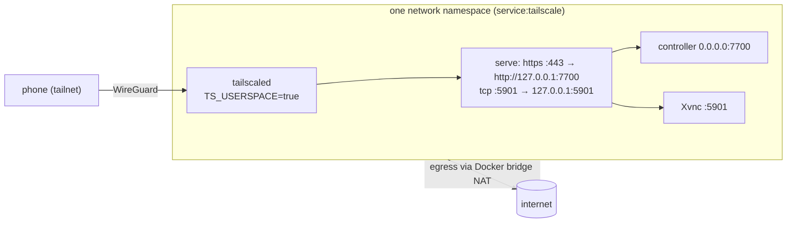

# Networking and Tailscale

Tailscale is the only transport between the phone and the sandbox. The
default mode needs nothing on the host except Docker. Decision record:
[ADR 0003](../adr/0003-single-sandbox-container-with-tailscale-sidecar.md).

## Modes

| Mode | Compose files | Reachability | Use when |
|---|---|---|---|
| `tailscale` (default) | `compose.yml` + `compose.tailscale.yml` | `https://<TESSERACT_HOSTNAME>.<tailnet>.ts.net` (443 → 7700) and `<TESSERACT_HOSTNAME>:5901`; **no host ports** | normal use |
| `host-tailscale` | `compose.yml` + `compose.local.yml`, `TESSERACT_BIND_ADDR=<host 100.x IP>` | `http://<host tailnet IP>:7700`, `:5901` (host ports `TESSERACT_CONTROLLER_HOST_PORT`, `TESSERACT_VNC_HOST_PORT`) | the host already runs Tailscale and you prefer not to add a node |
| `local` | `compose.yml` + `compose.local.yml`, `TESSERACT_BIND_ADDR=127.0.0.1` | `http://127.0.0.1:7700` on the host only (same host-port variables) | development, e2e tests, CI |
| `+tailscale-api` | tailscale: + `compose.tailscale-api-sidecar.yml`; host-tailscale, local: + `compose.tailscale-api.yml` | unchanged; the sandbox can query tailscaled's LocalAPI for `GET /v1/identity` | the app should show the real Tailscale user and node ([below](#tailscale-identity-localapi)) |
| `+dind` | any of the above + `compose.dind.yml` | unchanged; adds a Docker daemon for the sandbox | projects that need Docker ([ADR 0006](../adr/0006-optional-docker-in-docker.md)) |

The operator CLI picks the files. The mode comes from `--mode <mode>` (for
example `bun run sandbox up --mode local`), then `TESSERACT_MODE` in the
environment or `infra/compose/.env`, and defaults to `tailscale`. dind is added
with `--dind` or `TESSERACT_DIND=1`, the LocalAPI share with `--tailscale-api` or
`TESSERACT_TAILSCALE_LOCALAPI=1`. The modes are overlay files, not compose
profiles. The CLI reads `infra/compose/.env`, or only the file named with
`--env-file <path>` (which it also hands to compose). In `host-tailscale` mode it
runs the read-only `tailscale ip -4` on the host when `TESSERACT_BIND_ADDR` is
empty, and refuses anything but an IPv4 address (no wildcard spelling such as
`0.0.0.0`, `::` or `[::0]`, no `0.x.x.x`, no host names). In `tailscale` mode it
refuses to start without `TS_TAILNET_DOMAIN`, and on the first start (no
`<prefix>-tailscale` volume yet) without `TS_AUTHKEY`. See the
[getting started](../runbooks/getting-started.md) runbook.

Several stacks can run on one host when each has its own
`TESSERACT_COMPOSE_PROJECT` (container and network names; the volume prefix
follows unless `TESSERACT_VOLUME_PREFIX` is set) and its own host ports (local,
host-tailscale) or `TESSERACT_HOSTNAME` (tailscale). The e2e harness uses this
(`tesseract-e2e` on `127.0.0.1:17700/15901`).

## Default mode: userspace sidecar



- The `tailscale` service runs the official `tailscale/tailscale` image with
  `TS_USERSPACE=true`. It needs no `/dev/net/tun` and no `NET_ADMIN`.
- The `sandbox` service uses `network_mode: service:tailscale`, so both share
  one network namespace. `127.0.0.1:7700` inside the sandbox is the same
  socket that serve proxies to.
- Sidecar settings (`compose.tailscale.yml`; values from `infra/compose/.env`):

  | Variable | Value / source | Purpose |
  |---|---|---|
  | `TS_AUTHKEY` | `.env` | used on first login. Prefer a tagged (`tag:tesseract`), pre-approved key |
  | `TS_HOSTNAME` | `TESSERACT_HOSTNAME` (default `tesseract-sandbox`) | node name. Also the sandbox id shown in the app |
  | `TS_STATE_DIR` | `/var/lib/tailscale` on volume `<prefix>-tailscale` (default `tesseract-tailscale`) | keeps the node identity across restarts and recreation |
  | `TS_AUTH_ONCE` | `true` | log in only when there is no state; the key is not needed afterwards |
  | `TS_USERSPACE` | `true` | no kernel networking, no extra privileges |
  | `TS_SERVE_CONFIG` | `/config/serve.json` (`./tailscale` mounted read-only) | serve configuration, below |
  | `TS_EXTRA_ARGS` | `.env`, optional | extra `tailscale up` flags, e.g. `--advertise-tags=tag:tesseract` |

  The sidecar also runs with `no-new-privileges`. It keeps Docker's default
  capability set; dropping all capabilities is untested
  ([open decision](../roadmap.md#open-decisions)).
- The sandbox gets `TESSERACT_PUBLIC_URL=https://${TESSERACT_HOSTNAME}.${TS_TAILNET_DOMAIN}`.
  Set `TS_TAILNET_DOMAIN` (e.g. `tail1234.ts.net`, shown on the admin console's
  DNS page) in `.env`. The URL is only used to build the pairing link.

### Serve configuration

`infra/compose/tailscale/serve.json` has this shape. `${TS_CERT_DOMAIN}` is
substituted by the container with the node's MagicDNS name:

```json
{
  "TCP": {
    "443": { "HTTPS": true },
    "5901": { "TCPForward": "127.0.0.1:5901" }
  },
  "Web": {
    "${TS_CERT_DOMAIN}:443": {
      "Handlers": { "/": { "Proxy": "http://127.0.0.1:7700" } }
    }
  },
  "AllowFunnel": { "${TS_CERT_DOMAIN}:443": false }
}
```

Serve proxies WebSocket upgrades, so `/v1/events`, terminal streams and the
VNC bridge work through the same HTTPS endpoint.

### MagicDNS and HTTPS certificates

In the Tailscale admin console:

1. **DNS → MagicDNS: on.** This gives names like `tesseract-sandbox.tail1234.ts.net`.
2. **DNS → HTTPS Certificates: enable.** Serve then obtains a Let's Encrypt
   certificate for the node name on the first HTTPS request. The first
   request can take a few seconds.
3. The phone must run the Tailscale app, be logged into the same tailnet, and
   have the VPN connected.

Without HTTPS certificates, serve cannot terminate TLS on 443. Use
`host-tailscale` mode, or plain HTTP over the tailnet, while you fix it. The
connection is still WireGuard-encrypted, but release builds of the app may
refuse cleartext (Android blocks it unless `usesCleartextTraffic` is set; iOS
applies App Transport Security), and `app.json` configures neither. Plain HTTP
is verified with development builds only.
Whether release builds should is an [open decision](../roadmap.md#open-decisions).

### Auth keys, tags and ACLs

- Create the key under **Settings → Keys → Generate auth key**: reusable off,
  ephemeral off (so the node survives restarts via its state volume),
  pre-approved on, tags `tag:tesseract`.
- The key is used on first login only (`TS_AUTH_ONCE=true`). After that the
  node key lives in the `<prefix>-tailscale` volume and `TS_AUTHKEY` can be
  removed from `.env`. Deleting that volume requires a new key. A new key on its own is
  ignored while the volume exists: switch with `tesseract server install --authkey <key>
  --reset-tailscale`, and diagnose with `tesseract doctor tailnet`.
- Suggested policy (grants syntax):

  ```jsonc
  {
    "tagOwners": { "tag:tesseract": ["autogroup:admin"] },
    "grants": [
      // your devices → the sandbox: controller over HTTPS, native VNC
      { "src": ["autogroup:member"], "dst": ["tag:tesseract"], "ip": ["tcp:443", "tcp:5901"] }
      // no grant with src tag:tesseract: the sandbox cannot initiate connections to other tailnet nodes
    ]
  }
  ```

  Narrow `src` to your own user (`"you@example.com"`) on shared tailnets.
- In userspace mode, tailscaled forwards inbound tailnet TCP to the matching
  loopback port of the namespace. Without port-restricted ACLs, peers could
  also reach `:7700` (plain HTTP, token still required) and any dev server
  port. The grant above restricts that.

## `host-tailscale` mode

For hosts that already run Tailscale. `compose.local.yml` publishes
`${TESSERACT_BIND_ADDR}:${TESSERACT_CONTROLLER_HOST_PORT}:7700` and
`${TESSERACT_BIND_ADDR}:${TESSERACT_VNC_HOST_PORT}:5901` (defaults 7700 and 5901), with
`TESSERACT_BIND_ADDR` set to the host's own tailnet IP. When it is empty, the CLI
fills it from `tailscale ip -4` on the host (read-only). Nothing is bound on LAN or public interfaces.

- The URL is `http://<100.x.y.z>:7700`, or `http://<host>.<tailnet>.ts.net:7700`
  with MagicDNS. There is no TLS unless you run `tailscale serve` on the host,
  which is a host change the operator makes deliberately.
- The host's Tailscale ACLs decide who can reach those ports.
- `compose.local.yml` sets `TESSERACT_PUBLIC_URL=http://${TESSERACT_BIND_ADDR}:${TESSERACT_CONTROLLER_HOST_PORT}`,
  so the pairing link uses the tailnet IP.

## `local` mode

Binds `127.0.0.1:7700` and `127.0.0.1:5901` on the host. Use it for
end-to-end testing against a real image, for a simulator or emulator on the same machine,
or behind an SSH tunnel (`ssh -L 7700:127.0.0.1:7700 host`). The public URL is
`http://127.0.0.1:7700`.

## What is never exposed

- No port is published on a host interface in `tailscale` mode. In the other
  modes, ports are bound only to the chosen address, never `0.0.0.0`.
- Funnel is never enabled, so nothing is reachable from the internet.
- The dind daemon's API (`tcp://docker:2376`, mutual TLS) is reachable only
  from the compose network, never published.
- The sidecar's state volume is never mounted into the sandbox, and its LocalAPI
  socket (or the host's) only with the opt-in `--tailscale-api`.

## Tailscale identity (LocalAPI)

`GET /v1/identity` tells the app who is calling (`viewer`), which tailnet node the
sandbox is reachable through (`node`), who owns it (`owner`) and the tailnet's MagicDNS
suffix. The controller resolves it like this:

1. **Serve headers.** `tailscale serve` adds `Tailscale-User-Login`, `Tailscale-User-Name`
   and `Tailscale-User-Profile-Pic` to proxied requests (not for tagged source devices).
   They are trusted only when the TCP peer is loopback, because serve proxies from
   `127.0.0.1` inside the shared namespace. This works in `tailscale` mode without any
   socket.
2. **LocalAPI whois.** Otherwise the controller asks tailscaled
   (`GET /localapi/v0/whois?addr=<peer ip:port>`) over the unix socket
   `TESSERACT_TAILSCALE_SOCKET` (default `/run/tailscale/tailscaled.sock`).
3. **LocalAPI status** gives `node` (`Self`), `owner` (`User[Self.UserID]`) and
   `tailnet`; it is cached for 30 s. Calls time out after 1.5 s; no socket means
   `available: false` and nulls, never an error response.

The socket is only there with `--tailscale-api` (`TESSERACT_TAILSCALE_LOCALAPI=1`):

| Mode | What is shared |
|---|---|
| `tailscale` | `compose.tailscale-api-sidecar.yml` sets `TS_SOCKET=/var/run/tailscale/tailscaled.sock` in the sidecar, keeps that directory on the volume `<prefix>-tailscale-run` and mounts it read-only at `/run/tailscale` in the sandbox. `docker exec <project>-tailscale-1 tailscale status` then also works without `--socket` |
| `host-tailscale`, `local` | `compose.tailscale-api.yml` bind-mounts the host directory `TESSERACT_TAILSCALE_HOST_SOCKET_DIR` (default `/var/run/tailscale`) read-only at `/run/tailscale`. The directory, not the socket file, so a tailscaled restart does not leave a stale socket. `sandbox up` refuses when `tailscaled.sock` is missing there |

In `host-tailscale` mode, Docker's port publishing DNATs tailnet traffic that arrives on
`tailscale0`, so the controller sees the peer's own tailnet address and whois resolves the
phone's user and device. Traffic that goes through `docker-proxy` instead (for example a
connection from the host to `127.0.0.1`, which host-tailscale does not bind) would show
the Docker gateway and resolve no viewer; the owner and node are still reported. In
`tailscale` mode without serve (a peer on plain `:7700`), userspace forwarding makes the
peer look like loopback, so there is no viewer either.

A mounted read-only socket still accepts requests: the `:ro` flag only protects the
directory entry. What a client may do is decided by tailscaled from the peer's uid; see
the [security model](security-model.md#tailscale-localapi-opt-in) before enabling it.

## Egress

Outbound traffic from the sandbox (npm, Maven, GitHub, Anthropic API) leaves
through the shared namespace's Docker bridge, NATed by the host like any
container. It does not use the tailnet and does not use an exit node. It is not
filtered: the sandbox can also reach host services published on `0.0.0.0`, the
host's LAN and cloud metadata endpoints. Egress filtering (host `DOCKER-USER`
rules or an egress proxy) is a roadmap item.

## Checking connectivity

```bash
bun run sandbox status                             # compose state and controller status
bun run sandbox doctor                             # tesseract-doctor inside the sandbox
docker exec tesseract-tailscale-1 tailscale status    # node state as seen by the sidecar
docker exec tesseract-tailscale-1 tailscale serve status
curl -fsS https://tesseract-sandbox.<tailnet>.ts.net/v1/health   # from any tailnet device
```

Symptoms and fixes: [runbooks/troubleshooting.md](../runbooks/troubleshooting.md#connectivity).
