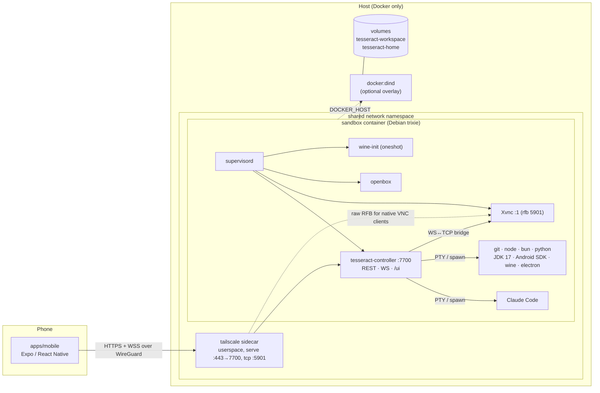
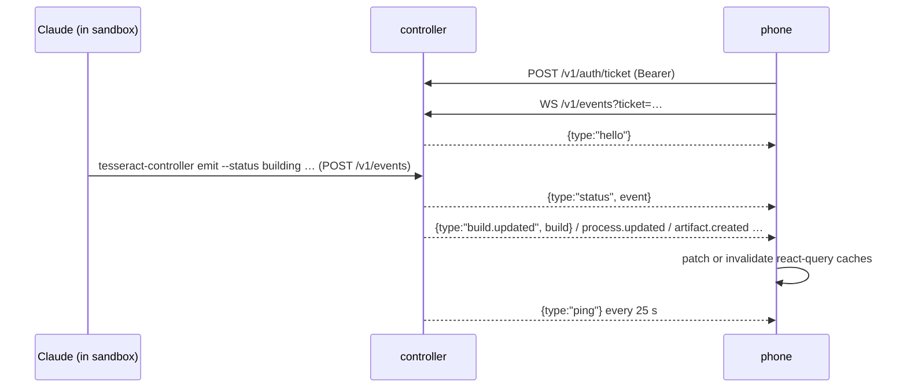
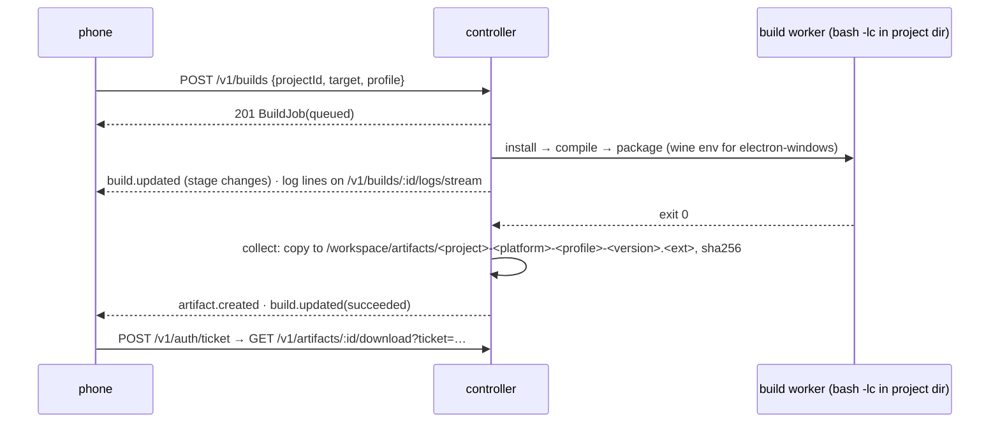
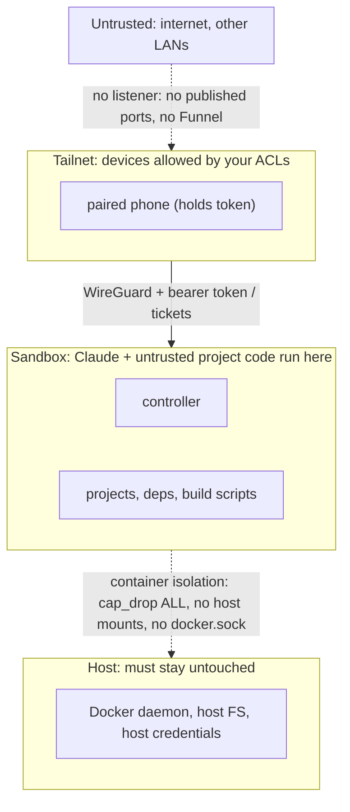

# Architecture overview

Tesseract turns a Docker host into a development machine that you drive from a
phone. The phone never runs builds and the host never runs development
tooling. Everything happens in one sandbox container, and a single daemon in
that container, the controller, is the only way in.

Names, ports and paths below come from the [blueprint](00-blueprint.md).

## Components



| Component | Location | Role |
|---|---|---|
| Mobile app | [`apps/mobile`](../../apps/mobile) | Remote control. Pairs with sandboxes, shows status, projects, builds, artifacts, terminals, the display and Claude runs. Holds no authoritative state. See [mobile-app.md](mobile-app.md). |
| `@tesseract/protocol` | [`packages/protocol`](../../packages/protocol) | zod schemas, types, constants, URL and pairing helpers: the wire contract. See [protocol.md](protocol.md). |
| `@tesseract/client` | [`packages/client`](../../packages/client) | Typed REST/WS client that runs in React Native, browsers and Bun. |
| Controller | [`apps/controller`](../../apps/controller) → `/usr/local/bin/tesseract-controller` | Bun + Hono daemon inside the sandbox: API, process/PTY/build supervision, VNC bridge, `/ui` pages, `.agent/RUNTIME.md` mirror, CLI (including `api`, the agent's way to call the API). See [controller.md](controller.md). |
| Sandbox image | [`infra/docker/sandbox`](../../infra/docker/sandbox) | Debian trixie with the desktop, wine, Node/Bun/Python, optional Android SDK and Claude Code. See [sandbox-image.md](sandbox-image.md). |
| Compose stack | [`infra/compose`](../../infra/compose) | Project `tesseract` by default (`TESSERACT_COMPOSE_PROJECT`): `sandbox`, `tailscale` sidecar, optional `docker` (dind) overlay. See [networking-tailscale.md](networking-tailscale.md). |
| Operator CLI | [`infra/scripts/sandbox`](../../infra/scripts/sandbox) | `bun run sandbox <command>` on the host: `up`, `down`, `restart`, `logs`, `shell`, `pair`, `status`, `doctor`, `build`, `ps`, `config`, with `--mode`, `--dind` and `--env-file`. |
| Tests | [`infra/tests`](../../infra/tests), [`infra/e2e`](../../infra/e2e) | bats suites for the infra scripts (`bun run test:infra`) and the end-to-end suite against a real stack (`bun run e2e`). See [e2e-testing](../runbooks/e2e-testing.md). |
| Agent spec | [`SPEC.md`](../../SPEC.md) | Rules for Claude inside the sandbox, installed as `/home/dev/.claude/CLAUDE.md`. |

## Data flows

### Pairing

```mermaid
sequenceDiagram
  actor Op as Operator (host shell)
  participant CLI as sandbox CLI
  participant C as controller
  participant P as phone
  Op->>CLI: bun run sandbox pair
  CLI->>C: docker compose exec sandbox tesseract-controller pair
  C-->>Op: tesseract://pair?url=https://tesseract-sandbox.<tailnet>.ts.net&token=…&name=… + ANSI QR
  P->>P: scan QR (expo-camera) or open deep link or paste
  P->>C: GET /v1/health (public, checks protocolVersion) then GET /v1/status (Bearer token)
  C-->>P: Health, SandboxStatus
  P->>P: token → expo-secure-store; sandbox added to the sandbox store and made active
```

The pairing URL comes from `TESSERACT_PUBLIC_URL`. In tailscale mode that is
the MagicDNS HTTPS name. Details: [runbooks/pairing-mobile.md](../runbooks/pairing-mobile.md).

### Status and live updates



The phone opens one events socket per active sandbox. The socket does not
replay history, so after a reconnect the app refetches.

### Terminal

1. `POST /v1/terminals { kind: "shell" | "claude", projectId?, cols, rows }`
   makes the controller spawn a PTY (bash, or `claude`) as `dev` in the project dir.
2. The app gets a ticket and opens a WebView on
   `<base>/ui/terminal#ticket=…&session=trm_…`.
3. The page (xterm.js, served by the controller) opens
   `WS /v1/terminals/:id/stream?ticket=…`, receives the scrollback replay
   (≤ 256 KiB), then streams `input`/`resize` and `output`/`exit` frames.
4. When the phone disconnects, the PTY keeps running. When the page's socket
   drops it asks the app for a new ticket (`terminal-need-ticket`), and the app
   answers automatically; re-attaching replays the scrollback.

### VNC

1. `GET /v1/display` returns availability, geometry and the VNC password.
2. The app gets a ticket and opens a WebView on `<base>/ui/vnc#ticket=…&password=…`.
3. noVNC (served by the controller) connects to `WS /v1/display/vnc?ticket=…`.
   The controller bridges WS frames to TCP `127.0.0.1:5901` (Xvnc). RFB VncAuth
   runs end to end inside the tunnel.
4. Native VNC clients on the tailnet can connect to `tesseract-sandbox:5901`
   directly. The sidecar forwards that TCP port.

Details: [display-vnc.md](display-vnc.md).

### App runs and the Android emulator

`POST /v1/projects/:id/app-runs` starts a project's app as tracked processes and
reports how the phone opens it once ready: a URL (web, Expo web, Flutter web), an
Expo deep link, the sandbox display (Flutter Linux, Electron) or the Android
emulator. The emulator runs on the host (KVM) under the host shell daemon, which
dials the sandbox (`/v1/android/link`) so the sandbox's adb reaches it as
`127.0.0.1:15555`, and streams its screen to the phone (`/ui/android`).
Details: [app-runs-and-emulator.md](app-runs-and-emulator.md).

### Build



Recipes: [controller.md](controller.md#build-queue-and-recipes). Windows
specifics: [electron-windows-wine.md](electron-windows-wine.md).

### Claude run (headless)

1. `POST /v1/agent/runs { projectId?, prompt, resumeSessionId? }`.
2. The controller spawns `claude -p` with streaming JSON output and
   `--permission-mode bypassPermissions` in the project dir. Claude loads
   `/home/dev/.claude/CLAUDE.md` (SPEC.md) and the project's own `CLAUDE.md`.
3. Stream messages are condensed into `AgentRunEvent`s. They are persisted,
   broadcast as `agent.updated`, and streamed on `/v1/agent/runs/:id/stream`.
4. While it works, Claude reports milestones with `tesseract-controller emit`
   and starts long work through the controller (`tesseract-controller api`:
   builds, `display: true` processes). Anything it merely backgrounds is
   stopped when the run ends.
5. The run ends with `result`, token `usage` and `sessionId`. The phone can
   continue the conversation with `resumeSessionId`.

Interactive Claude runs in a `claude` terminal instead: same PTY path as the
shell. See [runbooks/claude-in-sandbox.md](../runbooks/claude-in-sandbox.md).

## Trust boundaries



| Boundary | Enforced by |
|---|---|
| Internet → tailnet | Nothing listens publicly. Tailscale mode publishes no host ports and never enables Funnel. |
| Tailnet → controller | Tailscale ACLs (who can reach the node), then the bearer token or a one-time ticket on every request except `/v1/health`. |
| Controller → sandbox | By design, the controller runs anything the token holder asks as `dev`. The token is equivalent to a shell in the sandbox. |
| Project code → sandbox | None inside the sandbox. Untrusted code, Claude with `bypassPermissions` and the controller share user `dev`. SPEC.md governs Claude's behavior; the controller only avoids executing repository content itself and keeps its secrets out of children's environments. |
| Sandbox → host | Container isolation: no `privileged`, `cap_drop: [ALL]` with a minimal allow-list, no host bind mounts, no Docker socket, resource limits, userspace Tailscale. dind weakens this; see [ADR 0006](../adr/0006-optional-docker-in-docker.md). |

The threat model is in [security-model.md](security-model.md).
