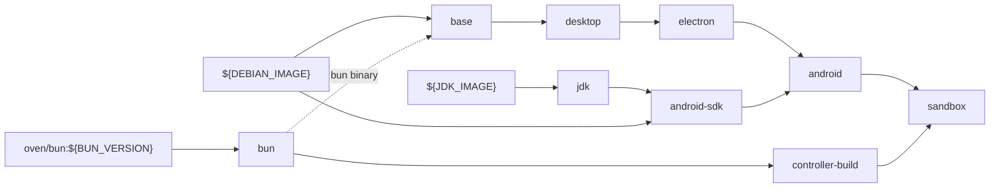

# Sandbox image

`infra/docker/sandbox/Dockerfile` builds `theone/sandbox`: the development
machine. Its build context is the repository root, because the controller is
compiled from workspace sources in the first stage.

```bash
bun run sandbox build            # compose build → $THEONE_IMAGE (default theone/sandbox:latest; build args from the env file)
# or directly:
docker build -f infra/docker/sandbox/Dockerfile --target sandbox -t theone/sandbox:dev .
```

`.dockerignore` keeps `node_modules`, `dist`, `docs`, the mobile app sources
(only `apps/mobile/package.json` is needed for the frozen lockfile) and
`infra/compose/.env` out of the context.

## Stages



| Stage | Adds |
|---|---|
| `bun`, `jdk` | aliases of `oven/bun:${BUN_VERSION}` and `${JDK_IMAGE}`, so later stages can `COPY --from` them |
| `controller-build` | from `bun`: filtered `bun install --frozen-lockfile --filter @theone/controller`, then `bun build --compile` (for the build platform) to `apps/controller/dist/theone-controller` |
| `base` | Debian trixie, tini, supervisor, sudo, git and git-lfs, curl, jq, ripgrep, fd, build-essential, python3/pip/venv/pipx, sqlite3, tmux, zip/unzip, Docker CLI with compose and buildx plugins (no daemon), Node `${NODE_MAJOR}` from nodejs.org (checked against `SHASUMS256.txt`) with corepack (pnpm, yarn), the bun binary, locales, fonts, and the `dev` user with `/run/user/<uid>` |
| `desktop` | TigerVNC (`Xvnc`, `vncpasswd`), openbox, xterm, x11-apps (`xwd`, the screenshot fallback), x11-utils (`xdpyinfo`), x11-xserver-utils (`xrandr`), xdotool, ImageMagick, dbus-x11, Chromium, and the Electron runtime libraries (gtk3, nss, gbm, asound, xss, xtst, secret, notify) |
| `electron` | wine (`wine`, `wine64`, `wine32:i386`; `/usr/local/bin/wine64` points at `/usr/lib/wine/wine64` because electron-winstaller calls `wine64`), `osslsigncode`, `fakeroot`, `dpkg-dev`, `rpm`, and `mono-complete` when `WITH_MONO=true` |
| `android-sdk` | (side stage from `${DEBIAN_IMAGE}`) the JDK from `jdk`, Android cmdline-tools `${ANDROID_CMDLINE_TOOLS_BUILD}` (sha256-verified), `platform-tools`, `platforms;${ANDROID_PLATFORM}`, `build-tools;${ANDROID_BUILD_TOOLS}`, licenses accepted. With `WITH_ANDROID=false` it produces empty directories |
| `android` | copies the JDK to `/opt/java/openjdk` and the SDK to `/opt/android-sdk` (owned by `dev`), plus `/etc/profile.d/theone.sh` |
| `sandbox` (default) | Claude Code (`npm i -g @anthropic-ai/claude-code@${CLAUDE_CODE_VERSION}`, installed last so a version bump rebuilds one layer), the rootfs overlay (supervisord confs, entrypoint, helpers, openbox config, chromium flags, agent templates), `SPEC.md` → `/etc/theone/SPEC.md`, and the controller binary → `/usr/local/bin/theone-controller` |

apt downloads go to BuildKit cache mounts (`theone-apt-cache`,
`theone-apt-lists`), and npm and bun caches likewise, so rebuilds after small
changes are fast.

### Build arguments

| Arg | Default | Effect |
|---|---|---|
| `DEV_UID` / `DEV_GID` | `1000` | uid/gid of `dev`. Match your host user if you ever inspect volumes from the host |
| `DEBIAN_IMAGE` / `JDK_IMAGE` | `debian:trixie-slim` / `eclipse-temurin:17-jdk` | pin by digest for reproducible builds |
| `ANDROID_CMDLINE_TOOLS_BUILD` / `ANDROID_CMDLINE_TOOLS_SHA256` | `16111833` / its sha256 | change both together |
| `NODE_MAJOR` / `NODE_VERSION` | `24` / newest 24.x | pin `NODE_VERSION=24.x.y` for reproducible images |
| `BUN_VERSION` | `1.4.2` | also used for the controller build |
| `CLAUDE_CODE_VERSION` | `latest` | pin to control when Claude Code changes (its auto-updater is off: `DISABLE_AUTOUPDATER=1`) |
| `ENABLE_SUDO` | `true` | passwordless sudo for `dev`. `false` removes container root from Claude and project code |
| `WITH_MONO` | `true` | Squirrel.Windows support (large) |
| `WITH_ANDROID` | `true` | JDK 17 and Android SDK (about 750 MB, per `.env.example`). `false` for faster, smaller images |
| `ANDROID_PLATFORM` / `ANDROID_BUILD_TOOLS` | `android-36` / `36.0.0` | preinstalled SDK packages |
| `THEONE_IMAGE_VERSION` | `0.1.0` | label and `THEONE_IMAGE_VERSION` env |

Compose passes `DEV_UID`, `DEV_GID`, `WITH_ANDROID`, `WITH_MONO` and
`CLAUDE_CODE_VERSION` from the env file and tags the result `THEONE_IMAGE`.
`bun run sandbox build --target <stage>` builds another stage with `docker build`
and tags it `theone/sandbox:<stage>`.

Image environment: `THEONE_IMAGE_VERSION`, `THEONE_WORKSPACE=/workspace`,
`THEONE_HOST=0.0.0.0`, `THEONE_PORT=7700`, `THEONE_DATA_DIR`, `THEONE_VNC_HOST`,
`THEONE_DISPLAY=:1`, `THEONE_DISPLAY_GEOMETRY`, `THEONE_VNC_PORT=5901`,
`XDG_RUNTIME_DIR=/run/user/<uid>`, `WINEPREFIX`, `WINEARCH=win64`, `WINEDEBUG=-all`,
`APPIMAGE_EXTRACT_AND_RUN=1`, `JAVA_HOME`, `ANDROID_HOME`, `ANDROID_SDK_ROOT`,
`DISABLE_AUTOUPDATER=1`, `LANG=en_US.UTF-8`, `TZ=UTC` and quiet npm/pip/corepack
settings. `DISPLAY` is deliberately not set image-wide.

## Users and permissions

- `dev` (uid/gid 1000, shell bash, home `/home/dev`) runs everything:
  supervisord itself, its programs, the controller, and therefore every
  terminal, process, build and Claude run.
- Root is used only by the entrypoint (volume ownership, per-start files). It
  never follows symlinks planted in the dev-writable volumes (symlinked
  directories are replaced, files are renamed into place), and its tool-version
  probes for `ENVIRONMENT.md` run as `dev` (`runuser -u dev -- timeout 20 …`),
  because some tools live in dev-writable paths such as `/opt/android-sdk`.
- supervisord starts as root but drops to `dev` (`user=dev`) before it opens its
  socket or logs, which live in the dev-writable workspace. The socket
  `/run/supervisor/supervisor.sock` (0700) belongs to `dev`, so
  `supervisorctl status` and `supervisorctl restart controller` work inside the sandbox.
- Secrets: the entrypoint writes the VNC password and, when compose sets it,
  `THEONE_TOKEN` into `/run/theone/controller.env` (0600, dev; the directory is
  root-owned) and unsets both before starting supervisord, so only the
  controller (through `theone-controller-run`) has them. The controller in turn
  strips them from every child.
- With `ENABLE_SUDO=true`, `dev` can `sudo`. Compose drops all capabilities
  except `CHOWN, DAC_OVERRIDE, FOWNER, SETUID, SETGID, KILL, AUDIT_WRITE`, so
  container root cannot mount, load modules, change networking or trace other processes.

## Filesystem and volumes

| Path | Backing | Contents |
|---|---|---|
| `/workspace` | volume `<prefix>-workspace` (default `theone-workspace`) | `projects/<id>`, `artifacts/`, `.agent/` (memory, controller data, supervisor logs) |
| `/home/dev` | volume `<prefix>-home` (default `theone-home`) | `.claude/` (login, CLAUDE.md, settings), `.wine/`, `.vnc/`, `.gradle/`, `.cache/` (electron, electron-builder, npm, bun), `.secrets/` |
| `/opt/android-sdk`, `/opt/java/openjdk` | image | SDK, owned by `dev`; runtime additions (NDK, CMake that Gradle installs) are lost on recreate |
| `/etc/theone/` | image | `SPEC.md`, `agent-templates/` |
| `/run/theone/` | container layer, rewritten on every start | `controller.env` with the VNC password (and `THEONE_TOKEN` if set), readable by `dev` only |
| `/run/supervisor/` | container layer | supervisord socket and pid file (0700, dev) |
| `/run/user/<uid>` | container layer | `XDG_RUNTIME_DIR` (0700, dev) |
| `/tmp` | container layer | scratch, X sockets (`/tmp/.X11-unix`), screenshots (`/tmp/theone-screenshots/`) |

Everything outside the two volumes is reset when the container is recreated
(`bun run sandbox up --build`, image upgrades). System packages installed with
`sudo apt-get` at runtime therefore disappear. Add them to the Dockerfile instead.

## Entrypoint

`/usr/local/bin/theone-entrypoint` runs as root under tini on every start,
is idempotent, and then execs supervisord. In order:

1. Drops empty `THEONE_*`, `ANTHROPIC_*`, `CLAUDE_*` and `DOCKER_*` variables
   (compose passes unset `.env` entries as empty strings).
2. Fixes ownership of `/workspace` and `/home/dev` if the volume root is not owned by `dev`.
3. Creates `/workspace/{projects,artifacts,.agent/{projects,logs/supervisor,controller}}`.
   `controller/` gets mode 0700.
4. Seeds missing files (including `projects/_template/`) from
   `/etc/theone/agent-templates/` into `/workspace/.agent/`. Existing files are
   never overwritten, so older workspaces keep older templates.
5. Installs `/etc/theone/SPEC.md` as `/home/dev/.claude/CLAUDE.md` **only if absent**.
6. Sets up the VNC password: `THEONE_VNC_PASSWORD`, or a previously generated
   one in `/home/dev/.vnc/password` (0600), or a new random 8-character one.
   Writes the `vncpasswd -f` hash to `/home/dev/.vnc/passwd` and writes the
   plaintext (plus `THEONE_TOKEN`, if set) to `/run/theone/controller.env` (0600).
7. Removes stale X locks for the display, creates `XDG_RUNTIME_DIR` and
   `/run/supervisor`, and hands `.agent/logs/supervisor` to `dev`.
8. Regenerates `/workspace/.agent/ENVIRONMENT.md` (tool versions, limits, paths,
   and the rule to use `theone-controller api`). A failure here is logged, not fatal.
9. Unsets `THEONE_TOKEN` and `THEONE_VNC_PASSWORD`, then
   `exec supervisord -n -c /etc/supervisor/supervisord.conf`, or runs the
   given command instead (`docker run … theone/sandbox:dev bash`).

## supervisord programs

| Program | Command | Notes |
|---|---|---|
| `xvnc` (priority 10) | `theone-xvnc` → `Xvnc :1 -geometry $THEONE_DISPLAY_GEOMETRY -depth 24 -rfbport 5901 -rfbauth ~/.vnc/passwd -SecurityTypes VncAuth -AlwaysShared -desktop "TheOne <id>" -nolisten tcp` | removes a lock left by a crashed server (only a live `Xvnc` may keep it) before starting |
| `openbox` (20) | `theone-wait-x dbus-run-session -- openbox-session` | waits for the display (`THEONE_WAIT_X_TIMEOUT`, 60 s). `dbus-run-session` ends the session bus with openbox. The desktop menu (right-click) has Terminal and Chromium |
| `controller` (30) | `theone-controller-run` → `theone-controller serve` | loads `/run/theone/controller.env` first; `stopwaitsecs=15`, `stopasgroup`/`killasgroup` |
| `wine-init` (40) | `theone-wait-x theone-wine-init` | oneshot: `WINEDLLOVERRIDES="mscoree,mshtml=" wineboot -u` if `~/.wine/system.reg` is missing |

All run as `dev` and restart automatically (except `wine-init`). Logs are
written to `/workspace/.agent/logs/supervisor/<program>.log` (5 MB, 2 backups;
`supervisord.log` likewise). Right after a start the controller can still be
`STARTING` in supervisord for a few seconds; `theone-doctor` reports that as a
warning, not a failure.

`HEALTHCHECK`: `curl -fsS http://127.0.0.1:${THEONE_PORT}/v1/health` every 30 s
(60 s start period).

## Helpers on `PATH`

| Command | Purpose |
|---|---|
| `theone-controller` | daemon and CLI: `serve`, `pair`, `status`, `emit`, `token`, `api` |
| `theone-screenshot [-d DISPLAY] [-w WINDOW] [OUT\|-]` | PNG of the display or of one window (ImageMagick `import`) |
| `theone-wait-x CMD…` | run a command once the X display is up |
| `theone-doctor` | in-sandbox self-check: display, window manager, VNC (RFB banner), controller, supervisor programs, wine prefix, node, bun, claude, Claude auth, java/adb, Docker, disk, writable workspace and home. Exits 1 on any FAIL; WARN/SKIP do not fail |
| `theone-xvnc`, `theone-controller-run`, `theone-wine-init` | supervisord program launchers |

`/etc/profile.d/theone.sh` restores `JAVA_HOME/bin`, the Android tools,
`~/.bun/bin` and `~/.local/bin` on `PATH` for login shells (the controller runs
jobs with `bash -lc`). Interactive login shells (terminals) also get
`DISPLAY=:1`; `bash -lc` jobs do not, so processes that need the display use
`display: true`.
`/etc/chromium.d/theone` adds `--no-sandbox --password-store=basic`, because
unprivileged user namespaces are unavailable in the container. Electron apps
need `--no-sandbox` for the same reason.

## Extending the image

- **More apt packages:** add them to the relevant stage's `apt-get install`
  list (keep lists alphabetical), then run `bun run sandbox build` and
  `bun run sandbox up`.
- **More Android packages:** extend the `sdkmanager --install` line in `android-sdk`.
- **Another toolchain** (Rust, Go, Flutter): add a stage after `android`, or
  install into `/home/dev` at runtime (persistent, but not reproducible).
- **Smaller image:** `--build-arg WITH_ANDROID=false --build-arg WITH_MONO=false`.
- **Rootfs changes:** files under `infra/docker/sandbox/rootfs/` are copied
  verbatim to `/`. Scripts in `usr/local/bin/theone-*` are made executable.
- Check shell and rootfs changes with `bun run test:infra`
  ([infra/tests](../../infra/tests/README.md)) and the image as a whole with
  `bun run e2e` ([e2e-testing](../runbooks/e2e-testing.md)).
- After changing `SPEC.md`, existing sandboxes keep their
  `~/.claude/CLAUDE.md`. See
  [claude-in-sandbox](../runbooks/claude-in-sandbox.md#2-specmd-as-the-user-level-claudemd).
